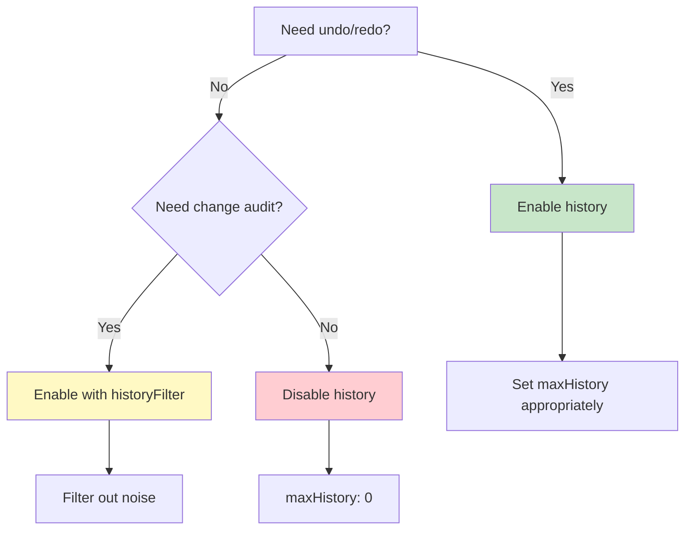

# Best Practices

Learn architectural patterns, common pitfalls, and recommended practices for using Chronicle effectively in production applications.

## Quick Decision Trees

### When to Use Batching?

```mermaid
graph TD
    A[Making multiple changes?] -->|Yes| B{Related changes?}
    A -->|No| C[Single change - no batching needed]
    B -->|Yes, logically grouped| D[Use batch\\(\\)]
    B -->|No, independent| E[Keep separate]
    D --> F{How many changes?}
    F -->|Many \\(100+\\)| G[batch\\(\\) is critical]
    F -->|Few \\(2-10\\)| H[batch\\(\\) is nice-to-have]

    style D fill:#c8e6c9
    style G fill:#81c784
    style H fill:#a5d6a7
    style E fill:#fff9c4
```

### Which Listener Mode?

```mermaid
graph TD
    A[Where is your data?] -->|Exact path| B[Use 'exact']
    A -->|Path + children| C[Use 'down' \\(default\\)]
    A -->|Path + ancestors| D[Use 'up']

    B --> B1[\"Only fires when<br/>that specific property changes\"]
    C --> C1[\"Fires when property<br/>or any descendant changes\"]
    D --> D1[\"Fires when property<br/>or any ancestor changes\"]

    style B fill:#e1f5fe
    style C fill:#c8e6c9
    style D fill:#fff9c4
```

### Should You Track History?



## Core Principles

### 1. Single Source of Truth

Keep one Chronicle instance per logical domain:

```typescript
// ✅ Good: Separate concerns
const appState = chronicle({
  user: null,
  session: null
});

const uiState = chronicle({
  modal: null,
  sidebar: 'collapsed'
});

const dataState = chronicle({
  items: [],
  cache: new Map()
});

// ❌ Bad: Everything in one giant object
const state = chronicle({
  // Mixing concerns makes it hard to manage
  user: null,
  modalOpen: false,
  items: [],
  sidebarCollapsed: true,
  cache: new Map()
});
```

### 2. Minimize Observable Surface

Only make observable what needs to be tracked:

```typescript
// ✅ Good: Separate observable and static
const config = {
  apiUrl: 'https://api.example.com',
  timeout: 5000
}; // Plain object (doesn't change)

const state = chronicle({
  data: [],
  loading: false
}); // Observable (changes frequently)

// ❌ Bad: Everything observable
const state = chronicle({
  apiUrl: 'https://api.example.com', // Never changes!
  timeout: 5000,                      // Never changes!
  data: [],
  loading: false
});
```

### 3. Batch Related Changes

Group logically related changes:

```typescript
// ✅ Good: Related changes batched
function updateUser(userId: string, updates: Partial<User>) {
  chronicle.batch(state, (s) => {
    const user = s.users.get(userId);
    if (user) {
      Object.assign(user, updates);
      user.updatedAt = Date.now();
      s.lastModified = Date.now();
    }
  });
}

// ❌ Bad: Changes scattered
function updateUser(userId: string, updates: Partial<User>) {
  const user = state.users.get(userId);
  if (user) {
    Object.assign(user, updates); // Change 1
  }
  state.users.get(userId).updatedAt = Date.now(); // Change 2
  state.lastModified = Date.now(); // Change 3
}
```

## Architectural Patterns

### Command Pattern

Encapsulate state changes as commands:

```typescript
interface Command {
  execute(): void;
  undo(): void;
}

class AddTodoCommand implements Command {
  constructor(
    private state: TodoState,
    private todo: Todo
  ) {}

  execute() {
    this.state.todos.push(this.todo);
  }

  undo() {
    chronicle.undo(this.state);
  }
}

// Usage
const command = new AddTodoCommand(state, newTodo);
command.execute();

// Later
command.undo();
```

### Repository Pattern

Abstract data access:

```typescript
class UserRepository {
  constructor(private state: DatabaseState) {}

  findById(id: string): User | undefined {
    return this.state.users.get(id);
  }

  save(user: User): void {
    chronicle.batch(this.state, (s) => {
      s.users.set(user.id, user);
      s.lastModified = Date.now();
    });
  }

  delete(id: string): boolean {
    return chronicle.batch(this.state, (s) => {
      const existed = s.users.has(id);
      s.users.delete(id);
      if (existed) {
        s.lastModified = Date.now();
      }
      return existed;
    });
  }

  findAll(): User[] {
    return Array.from(this.state.users.values());
  }
}

// Usage
const userRepo = new UserRepository(dbState);
const user = userRepo.findById('123');
```

### Store Pattern

Create domain-specific stores:

```typescript
class TodoStore {
  private state = chronicle<TodoState>({
    todos: [],
    filter: 'all'
  });

  // Getters
  get todos() {
    return this.state.todos;
  }

  get visibleTodos() {
    switch (this.state.filter) {
      case 'active':
        return this.state.todos.filter(t => !t.done);
      case 'completed':
        return this.state.todos.filter(t => t.done);
      default:
        return this.state.todos;
    }
  }

  // Actions
  addTodo(text: string) {
    this.state.todos.push({
      id: Date.now(),
      text,
      done: false
    });
  }

  toggleTodo(id: number) {
    const todo = this.state.todos.find(t => t.id === id);
    if (todo) {
      todo.done = !todo.done;
    }
  }

  setFilter(filter: 'all' | 'active' | 'completed') {
    this.state.filter = filter;
  }

  // History
  undo() {
    chronicle.undo(this.state);
  }

  redo() {
    chronicle.redo(this.state);
  }

  // Subscriptions
  subscribe(callback: () => void) {
    return chronicle.onAny(this.state, callback);
  }
}

// Usage
const todoStore = new TodoStore();
todoStore.addTodo('Buy milk');
todoStore.subscribe(() => renderApp());
```

### Mediator Pattern

Coordinate between multiple states:

```typescript
class AppMediator {
  constructor(
    private appState: AppState,
    private uiState: UIState,
    private dataState: DataState
  ) {
    this.setupListeners();
  }

  private setupListeners() {
    // When user logs in, load their data
    chronicle.listen(this.appState, 'user', async (_, user) => {
      if (user) {
        await this.loadUserData(user.id);
      }
    });

    // When data loads, update UI
    chronicle.listen(this.dataState, 'loading', (_, loading) => {
      this.uiState.showSpinner = loading;
    });
  }

  private async loadUserData(userId: string) {
    this.dataState.loading = true;
    try {
      const data = await api.getUserData(userId);
      chronicle.batch(this.dataState, (s) => {
        s.items = data.items;
        s.preferences = data.preferences;
        s.loading = false;
      });
    } catch (error) {
      this.dataState.loading = false;
      this.uiState.error = error.message;
    }
  }
}
```

## State Organization

### Normalize Complex Data

```typescript
// ✅ Good: Normalized structure
interface NormalizedState {
  users: Map<string, User>;
  posts: Map<string, Post>;
  comments: Map<string, Comment>;
}

// Easy lookups, no duplication
const user = state.users.get(userId);
const post = state.posts.get(postId);

// ❌ Bad: Denormalized structure
interface DenormalizedState {
  users: Array<{
    id: string;
    posts: Array<{
      id: string;
      comments: Comment[]; // Deeply nested!
    }>;
  }>;
}

// Hard to update a single comment
```

### Separate Derived State

```typescript
// ✅ Good: Compute derived values
function getTotalPrice(cart: Cart): number {
  return cart.items.reduce((sum, item) =>
    sum + item.price * item.quantity, 0
  );
}

// ❌ Bad: Store derived values
interface Cart {
  items: CartItem[];
  total: number; // Can become out of sync!
}
```

### Use Appropriate Data Structures

```typescript
// ✅ Good: Use Map for lookups
const state = chronicle({
  usersById: new Map<string, User>()
});

const user = state.usersById.get('123'); // O(1)

// ❌ Bad: Use array for lookups
const state = chronicle({
  users: [] as User[]
});

const user = state.users.find(u => u.id === '123'); // O(n)
```

## Listener Best Practices

### Clean Up Listeners

```typescript
// ✅ Good: Always clean up
class Component {
  private unlisten?: () => void;

  mount() {
    this.unlisten = chronicle.listen(state, 'data', this.handleData);
  }

  unmount() {
    this.unlisten?.();
  }
}

// React example
useEffect(() => {
  const unlisten = chronicle.listen(state, 'data', handleData);
  return unlisten; // Cleanup
}, []);
```

### Avoid Circular Dependencies

```typescript
// ❌ Bad: Circular listener updates
chronicle.listen(state, 'a', () => {
  state.b++; // Triggers b listener
});

chronicle.listen(state, 'b', () => {
  state.a++; // Triggers a listener → infinite loop!
});

// ✅ Good: One-way data flow
chronicle.listen(state, 'input', () => {
  state.output = transform(state.input);
});
```

### Use Specific Paths

```typescript
// ✅ Good: Specific path
chronicle.listen(state, 'user.preferences.theme', handleThemeChange);

// ❌ Bad: Too broad
chronicle.onAny(state, (path) => {
  if (path.join('.') === 'user.preferences.theme') {
    handleThemeChange();
  }
});
```

### Debounce Expensive Operations

```typescript
// ✅ Good: Debounced search
chronicle.listen(state, 'searchQuery', (_, query) => {
  performSearch(query);
}, { debounceMs: 300 });

// ❌ Bad: Search on every keystroke
chronicle.listen(state, 'searchQuery', (_, query) => {
  performSearch(query); // Too frequent!
});
```

## Testing Strategies

### Unit Testing

```typescript
import { describe, it, expect } from 'vitest';
import { chronicle } from '@arcmantle/chronicle';

describe('TodoStore', () => {
  it('should add todo', () => {
    const state = chronicle({ todos: [] });

    state.todos.push({ id: 1, text: 'Test', done: false });

    expect(state.todos).toHaveLength(1);
    expect(state.todos[0].text).toBe('Test');
  });

  it('should undo add todo', () => {
    const state = chronicle({ todos: [] });

    state.todos.push({ id: 1, text: 'Test', done: false });
    chronicle.undo(state);

    expect(state.todos).toHaveLength(0);
  });

  it('should notify listeners', () => {
    const state = chronicle({ count: 0 });
    const callback = vi.fn();

    chronicle.listen(state, 'count', callback);
    state.count = 1;

    expect(callback).toHaveBeenCalledOnce();
  });
});
```

### Integration Testing

```typescript
describe('TodoStore integration', () => {
  it('should handle complete workflow', () => {
    const store = new TodoStore();
    const callback = vi.fn();

    store.subscribe(callback);

    // Add todo
    store.addTodo('Test 1');
    expect(callback).toHaveBeenCalledTimes(1);

    // Add another
    store.addTodo('Test 2');
    expect(callback).toHaveBeenCalledTimes(2);

    // Toggle
    store.toggleTodo(store.todos[0].id);
    expect(callback).toHaveBeenCalledTimes(3);

    // Undo
    store.undo();
    expect(store.todos[0].done).toBe(false);
  });
});
```

### Snapshot Testing

```typescript
it('should match snapshot', () => {
  const state = chronicle({
    user: { name: 'Alice', email: 'alice@example.com' }
  });

  const snapshot = chronicle.snapshot(state);
  expect(snapshot).toMatchSnapshot();
});
```

### Testing with Mocked Time

```typescript
it('should handle time-based operations', () => {
  vi.useFakeTimers();

  const state = chronicle({ value: '' });
  const callback = vi.fn();

  chronicle.listen(state, 'value', callback, {
    debounceMs: 300
  });

  state.value = 'a';
  state.value = 'ab';
  state.value = 'abc';

  // Callback not called yet
  expect(callback).not.toHaveBeenCalled();

  // Fast-forward time
  vi.advanceTimersByTime(300);

  // Now called once
  expect(callback).toHaveBeenCalledOnce();
  expect(callback).toHaveBeenCalledWith(
    expect.anything(),
    'abc',
    expect.anything(),
    expect.anything()
  );

  vi.useRealTimers();
});
```

## Error Handling

### Graceful Listener Failures

```typescript
chronicle.listen(state, 'data', (path, data) => {
  try {
    processData(data);
  } catch (error) {
    console.error('Failed to process data:', error);
    // Don't throw - let other listeners run
  }
});
```

### Transaction Rollback

```typescript
async function saveChanges(state: any) {
  const backup = chronicle.snapshot(state);

  try {
    await chronicle.transaction(state, async (s) => {
      s.status = 'saving';
      await api.save(s.data);
      s.status = 'saved';
      s.lastSaved = Date.now();
    });
  } catch (error) {
    // Restore from backup
    Object.assign(state, backup);
    state.status = 'error';
    state.error = error.message;
  }
}
```

### Validation

```typescript
function validateAndSet<T>(
  state: T,
  key: keyof T,
  value: T[keyof T],
  validator: (value: T[keyof T]) => boolean
): boolean {
  if (!validator(value)) {
    console.error(`Invalid value for ${String(key)}:`, value);
    return false;
  }

  state[key] = value;
  return true;
}

// Usage
validateAndSet(
  state,
  'email',
  'invalid-email',
  (email) => email.includes('@')
); // false, not set
```

## Common Pitfalls

### ❌ Pitfall 1: Modifying State in Listeners

```typescript
// ❌ Bad: Creates infinite loop
chronicle.listen(state, 'count', () => {
  state.count++; // Triggers listener again!
});

// ✅ Good: Pure reaction
chronicle.listen(state, 'count', (_, count) => {
  updateUI(count); // No state modification
});
```

### ❌ Pitfall 2: Holding Stale References

```typescript
// ❌ Bad: Holding reference to nested object
const userRef = state.user;

state.user = newUser;

console.log(userRef.name); // Still old user!

// ✅ Good: Always access through state
console.log(state.user.name); // Current user
```

### ❌ Pitfall 3: Not Batching Bulk Operations

```typescript
// ❌ Bad: Each push creates history entry
for (const item of items) {
  state.items.push(item); // 1000 history entries!
}

// ✅ Good: One history entry
chronicle.batch(state, (s) => {
  for (const item of items) {
    s.items.push(item);
  }
});
```

### ❌ Pitfall 4: Over-Using onAny

```typescript
// ❌ Bad: Inefficient
chronicle.onAny(state, (path) => {
  if (path[0] === 'user') {
    updateUserUI();
  }
});

// ✅ Good: Specific listener
chronicle.listen(state, 'user', updateUserUI, 'down');
```

### ❌ Pitfall 5: Not Cleaning Up

```typescript
// ❌ Bad: Memory leak
function setupWatcher() {
  chronicle.listen(state, 'data', handleData);
  // Listener never removed!
}

// ✅ Good: Return cleanup function
function setupWatcher() {
  return chronicle.listen(state, 'data', handleData);
}

const unlisten = setupWatcher();
// Later:
unlisten();
```

## Production Checklist

Before deploying to production:

- [ ] **State organization**: Separate concerns, normalize data
- [ ] **Batching**: Bulk operations use `batch()`
- [ ] **History limits**: Set `maxHistory` appropriately
- [ ] **History filtering**: Filter UI-only state
- [ ] **Listener cleanup**: All listeners unsubscribed
- [ ] **Error handling**: Try/catch in critical listeners
- [ ] **Performance**: Debounce/throttle expensive operations
- [ ] **TypeScript**: Interfaces defined, strict mode enabled
- [ ] **Testing**: Unit and integration tests written
- [ ] **Documentation**: State shape documented
- [ ] **Monitoring**: Performance monitoring in place
- [ ] **Debugging**: Development-only debugging code removed

## Framework Integration Examples

### React

```typescript
// Create a custom hook
function useChronicle<T extends object>(
  initialState: T
): T {
  const [state] = useState(() => chronicle(initialState));
  const [, forceUpdate] = useReducer(x => x + 1, 0);

  useEffect(() => {
    return chronicle.onAny(state, forceUpdate);
  }, [state]);

  return state;
}

// Use in component
function TodoApp() {
  const state = useChronicle({
    todos: [],
    filter: 'all'
  });

  return (
    <div>
      <TodoList todos={state.todos} />
      <button onClick={() => chronicle.undo(state)}>
        Undo
      </button>
    </div>
  );
}
```

### Vue

```typescript
import { reactive, watchEffect } from 'vue';

// Create reactive Chronicle state
export function useChronicle<T extends object>(
  initialState: T
): T {
  const state = chronicle(initialState);

  // Make it reactive to Vue
  return reactive(state) as T;
}
```

### Svelte

```typescript
import { writable } from 'svelte/store';

function createChronicleStore<T extends object>(
  initialState: T
) {
  const state = chronicle(initialState);
  const { subscribe } = writable(state);

  chronicle.onAny(state, () => {
    // Notify Svelte of changes
    subscribe(() => {});
  });

  return {
    subscribe,
    state
  };
}
```

## Next Steps

You've completed the Chronicle guide! Here's what to explore next:

- **[API Reference →](../api/index)** - Complete API documentation
- **[Examples](../guide/getting-started#common-patterns)** - More real-world patterns
- **[GitHub Repository](https://github.com/arcmantle/chronicle)** - Source code and issues

---

**Questions?** Join the [GitHub Discussions](https://github.com/arcmantle/chronicle/discussions) or [file an issue](https://github.com/arcmantle/chronicle/issues).
