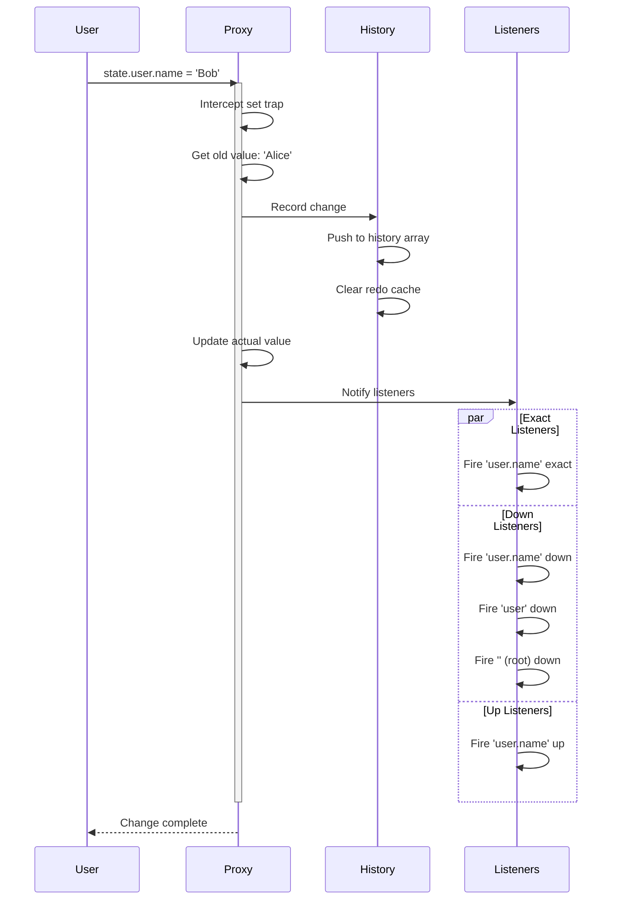

# Deep Observation

Learn how Chronicle automatically tracks changes to nested objects, arrays, Maps, and Sets using JavaScript Proxies.

## How It Works

When you call `chronicle()` on an object, Chronicle wraps it in a JavaScript **Proxy**. This proxy intercepts all property access and modifications, allowing Chronicle to:

1. **Track changes** to any property
2. **Record history** for undo/redo
3. **Notify listeners** when relevant data changes
4. **Create nested proxies** automatically

```typescript
import { chronicle } from '@arcmantle/chronicle';

// Before: Regular object
const regular = { count: 0 };
regular.count = 1; // No tracking, no history, no listeners

// After: Observable object
const observed = chronicle({ count: 0 });
observed.count = 1; // ✅ Tracked, recorded, listeners notified
```

## The Proxy Mechanism

### Single-Level Observation

For simple objects, Chronicle creates one proxy:

```typescript
const user = chronicle({
  name: 'Alice',
  age: 30
});

// Chronicle intercepts these operations:
user.name = 'Bob';    // Property set
delete user.age;       // Property delete
console.log(user.name); // Property get (for path tracking)
```

### Nested Observation

For nested objects, Chronicle creates proxies **on-demand** as you access them:

```typescript
const app = chronicle({
  user: {
    profile: {
      name: 'Alice',
      email: 'alice@example.com'
    }
  }
});

// When you access 'user', Chronicle creates a proxy for it
const userProxy = app.user; // Proxy created

// When you access 'profile', Chronicle creates another proxy
const profileProxy = app.user.profile; // Proxy created

// Now changes at any level are tracked
app.user.profile.name = 'Bob'; // ✅ Tracked!
```

## Change Notification Flow

When you modify a property, Chronicle follows this flow:



**Flow Steps:**

1. **Intercept**: Proxy catches the property set operation
2. **Capture**: Record old value before change
3. **History**: Add change to history stack, clear redo
4. **Mutate**: Apply the actual change to the object
5. **Notify**: Fire all matching listeners based on their modes
6. **Complete**: Return control to user code

### Visual Representation

```text
Original Object:
{
  user: {
    profile: {
      name: 'Alice'
    }
  }
}

After chronicle():
┌─────────────────────┐
│   Root Proxy        │
│   tracks: user      │
└──────────┬──────────┘
           │
           ↓
      ┌─────────────────────┐
      │   User Proxy        │
      │   tracks: profile   │
      └──────────┬──────────┘
                 │
                 ↓
            ┌─────────────────────┐
            │   Profile Proxy     │
            │   tracks: name      │
            └─────────────────────┘
```

## What Can Be Observed

Chronicle can track changes to:

### Objects

```typescript
const state = chronicle({
  name: 'Alice',
  age: 30,
  nested: { value: 42 }
});

state.name = 'Bob';           // ✅ Tracked
state.nested.value = 100;     // ✅ Tracked
state.newProp = 'hello';      // ✅ Tracked (new properties)
delete state.age;              // ✅ Tracked (deletions)
```

### Arrays

Chronicle intercepts all array methods:

```typescript
const list = chronicle({
  items: [1, 2, 3]
});

list.items.push(4);            // ✅ Tracked
list.items.pop();              // ✅ Tracked
list.items.splice(1, 1);       // ✅ Tracked
list.items[0] = 10;            // ✅ Tracked (index assignment)
list.items.sort();             // ✅ Tracked
list.items.reverse();          // ✅ Tracked
```

**Array Methods Tracked:**

- Mutating: `push`, `pop`, `shift`, `unshift`, `splice`, `sort`, `reverse`, `fill`, `copyWithin`
- Index assignment: `array[0] = value`
- Length changes: `array.length = 0`

::: tip Array Iteration
Non-mutating methods like `map`, `filter`, `forEach` don't trigger changes since they don't modify the array.
:::

### Maps

```typescript
const state = chronicle({
  cache: new Map()
});

state.cache.set('key', 'value');  // ✅ Tracked
state.cache.delete('key');         // ✅ Tracked
state.cache.clear();               // ✅ Tracked
```

### Sets

```typescript
const state = chronicle({
  tags: new Set()
});

state.tags.add('typescript');   // ✅ Tracked
state.tags.delete('javascript'); // ✅ Tracked
state.tags.clear();              // ✅ Tracked
```

### Class Instances

Chronicle works with class instances too:

```typescript
class User {
  constructor(
    public name: string,
    public email: string
  ) {}

  updateEmail(email: string) {
    this.email = email; // ✅ Tracked!
  }
}

const user = chronicle(new User('Alice', 'alice@example.com'));

user.name = 'Bob';           // ✅ Tracked
user.updateEmail('bob@ex.com'); // ✅ Tracked
```

## What Cannot Be Observed

Some values cannot be proxied or tracked:

### Primitives

Primitives (numbers, strings, booleans) cannot be proxied. Wrap them in an object:

```typescript
// ❌ Cannot observe primitives directly
const count = chronicle(42); // Error!

// ✅ Wrap in an object
const state = chronicle({ count: 42 });
state.count = 43; // Works!
```

### Functions

Function properties are passed through without observation:

```typescript
const state = chronicle({
  count: 0,
  increment() {
    this.count++; // ✅ this.count change is tracked
  }
});

state.increment(); // Function works, count change is tracked
state.increment = () => {}; // ✅ Reassignment tracked, but function itself isn't proxied
```

### Symbols

Symbol properties are not tracked:

```typescript
const sym = Symbol('id');
const state = chronicle({
  [sym]: 'value',
  name: 'Alice'
});

state[sym] = 'new value'; // ❌ Not tracked
state.name = 'Bob';        // ✅ Tracked
```

### Non-Extensible Objects

Frozen, sealed, or non-extensible objects cannot be proxied:

```typescript
const frozen = Object.freeze({ count: 0 });
const state = chronicle(frozen); // ⚠️ Works, but object remains frozen

state.count = 1; // ❌ Fails silently (frozen object)
```

::: warning Frozen Objects
Chronicle will wrap frozen objects but cannot track changes to them since they're immutable.
:::

## Proxy Caching

Chronicle caches proxies by default to ensure consistency and better performance:

```typescript
const state = chronicle({
  user: { name: 'Alice' }
});

const userRef1 = state.user;
const userRef2 = state.user;

console.log(userRef1 === userRef2); // true - same proxy (default behavior)
```

**Why this is enabled by default:**

- **Reference equality**: Multiple accesses return the same proxy
- **UI framework compatibility**: Works seamlessly with React, Vue, Solid, etc.
- **Listener stability**: Listeners attached to a proxy work across multiple accesses
- **Memory efficiency**: One proxy per object, not one per access
- **Memoization support**: Enables `useMemo`, `React.memo`, and other optimizations

### Disabling Proxy Caching

If you need fresh proxies on each access (rare):

```typescript
chronicle.configure(state, {
  cacheProxies: false
});

const userRef1 = state.user;
const userRef2 = state.user;
console.log(userRef1 === userRef2); // false - different proxies
```

::: tip Default Behavior
Proxy caching is **enabled by default** (since version 1.0) for better performance and UI framework integration. Most applications should keep this enabled.
:::

## Accessing the Original Object

Sometimes you need the original, unproxied object:

```typescript
import { chronicle } from '@arcmantle/chronicle';

const original = { count: 0 };
const observed = chronicle(original);

// Get the original back
const pristine = chronicle.snapshot(observed);
console.log(pristine === original); // false - it's a copy

// Or use the internal symbol (advanced)
import { SYMBOL_ID } from '@arcmantle/chronicle';
const metadata = observed[SYMBOL_ID];
```

::: tip Snapshots vs Originals
`chronicle.snapshot()` creates a **deep copy** of the current state, not a reference to the original object. This is useful for comparisons and exports.
:::

## Understanding Property Access

Chronicle tracks property access to build paths for listeners:

```typescript
const state = chronicle({
  user: {
    profile: {
      name: 'Alice'
    }
  }
});

chronicle.listen(state, 'user.profile.name', (path) => {
  console.log('Name changed!');
});

// When you do this:
state.user.profile.name = 'Bob';

// Chronicle builds the path:
// 1. Access 'user' → track path segment 'user'
// 2. Access 'profile' → track path segment 'profile'
// 3. Access 'name' → track path segment 'name'
// 4. Set 'Bob' → notify listeners at path ['user', 'profile', 'name']
```

## Performance Characteristics

### Proxy Overhead

Proxies have a small performance cost:

```typescript
const regular = { count: 0 };
const observed = chronicle({ count: 0 });

// Regular property access: ~0.5ns
for (let i = 0; i < 1000000; i++) {
  regular.count++;
}

// Proxied property access: ~2-5ns
for (let i = 0; i < 1000000; i++) {
  observed.count++;
}
```

**The overhead is negligible for most applications**, but be aware in tight loops.

::: tip Performance Best Practice
If you're doing intensive computation in a loop, consider working with the data directly and then assigning the result:

```typescript
// ❌ Slower: Multiple proxy calls
for (let i = 0; i < 1000000; i++) {
  state.total += calculate(i);
}

// ✅ Faster: Single proxy call
let total = state.total;
for (let i = 0; i < 1000000; i++) {
  total += calculate(i);
}
state.total = total;
```

:::

### Lazy Proxy Creation

Proxies are created only when needed:

```typescript
const state = chronicle({
  huge: {
    // Lots of nested data
    level1: {
      level2: {
        level3: { /* ... */ }
      }
    }
  }
});

// No proxies created yet for nested objects

// Proxies created on-demand:
const l1 = state.huge;        // Proxy for 'huge' created
const l2 = l1.level1;         // Proxy for 'level1' created
const l3 = l2.level2;         // Proxy for 'level2' created
```

This keeps memory usage low and startup fast.

## Working with Collections

### Array Patterns

```typescript
const state = chronicle({
  todos: []
});

// Listen to all array changes
chronicle.listen(state, 'todos', (path) => {
  console.log(`Array changed at: ${path.join('.')}`);
}, 'down');

// Different operations, all tracked:
state.todos.push({ id: 1, text: 'Buy milk' });
// Logs: "Array changed at: todos.0"

state.todos[0].text = 'Buy eggs';
// Logs: "Array changed at: todos.0.text"

state.todos.splice(0, 1);
// Logs: "Array changed at: todos"
```

### Map Patterns

```typescript
const state = chronicle({
  cache: new Map()
});

chronicle.listen(state, 'cache', (path, newVal, oldVal, meta) => {
  console.log(`Map operation: ${meta?.changeType}`);
  console.log(`Key: ${path[path.length - 1]}`);
}, 'down');

state.cache.set('user:1', { name: 'Alice' });
// Logs: "Map operation: set"
//       "Key: user:1"

state.cache.delete('user:1');
// Logs: "Map operation: delete"
//       "Key: user:1"
```

### Set Patterns

```typescript
const state = chronicle({
  tags: new Set()
});

chronicle.listen(state, 'tags', () => {
  console.log(`Tags now: ${[...state.tags].join(', ')}`);
}, 'down');

state.tags.add('typescript');
// Logs: "Tags now: typescript"

state.tags.add('javascript');
// Logs: "Tags now: typescript, javascript"

state.tags.delete('typescript');
// Logs: "Tags now: javascript"
```

## Mixed Structures

Chronicle handles complex, mixed data structures seamlessly:

```typescript
interface AppState {
  users: Map<string, {
    name: string;
    tags: Set<string>;
    history: Array<{ action: string; timestamp: number }>;
  }>;
}

const app = chronicle<AppState>({
  users: new Map()
});

// All layers are observable:
app.users.set('alice', {
  name: 'Alice',
  tags: new Set(['admin']),
  history: []
});

// Nested changes tracked:
app.users.get('alice')!.tags.add('developer');
app.users.get('alice')!.history.push({
  action: 'login',
  timestamp: Date.now()
});
app.users.get('alice')!.name = 'Alice Smith';
```

## Common Patterns

### Computed Properties

Create derived values that update automatically:

```typescript
const cart = chronicle({
  items: [] as Array<{ price: number; qty: number }>,
  discount: 0
});

// Computed total (not automatic - needs listener)
function getTotal(cart: typeof cart) {
  const subtotal = cart.items.reduce((sum, item) =>
    sum + item.price * item.qty, 0
  );
  return subtotal - cart.discount;
}

// Update UI when cart changes
chronicle.listen(cart, (path) => {
  console.log('Total:', getTotal(cart));
}, 'down');
```

### Nested Object Creation

Add new nested structures dynamically:

```typescript
const state = chronicle({
  users: {}
});

// Add new user (creates new nested proxy automatically)
state.users['alice'] = {
  name: 'Alice',
  profile: { bio: 'Developer' }
};

// Nested changes work immediately:
state.users['alice'].profile.bio = 'Senior Developer';
```

## Debugging Tips

### Checking if an Object is Observable

```typescript
import { SYMBOL_ID } from '@arcmantle/chronicle';

function isChronicle(obj: any): boolean {
  return obj && typeof obj === 'object' && SYMBOL_ID in obj;
}

const regular = { count: 0 };
const observed = chronicle({ count: 0 });

console.log(isChronicle(regular));   // false
console.log(isChronicle(observed));  // true
```

### Inspecting Proxy Metadata

```typescript
import { SYMBOL_ID } from '@arcmantle/chronicle';

const state = chronicle({ count: 0 });
const meta = state[SYMBOL_ID];

console.log(meta); // Internal Chronicle metadata
```

::: warning Internal API
The `SYMBOL_ID` and metadata structure are internal APIs and may change between versions. Use the public API whenever possible.
:::

## Next Steps

Now that you understand how Chronicle observes changes, learn how to react to them:

- **[Listeners →](./listeners)** - Master the art of listening to changes
- **[History →](./history)** - Explore undo/redo and time-travel
- **[Performance →](./performance)** - Optimize your Chronicle usage
- **[API Reference →](../api/index)** - Complete API documentation

---

**Ready to learn more?** Continue to [Listeners](./listeners) to master change detection.
