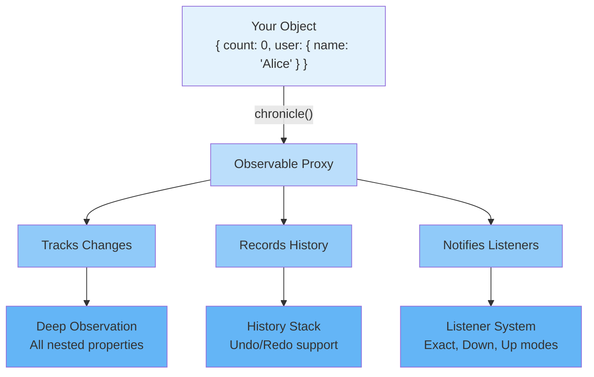

# Getting Started with Chronicle

Welcome to Chronicle! This guide will help you understand what Chronicle is, why you'd use it, and how to create your first observable state in just a few minutes.

## What is Chronicle?

Chronicle is a **deep observable state library** that automatically tracks changes to JavaScript objects, arrays, Maps, and Sets. It provides powerful features like:

- 🔍 **Automatic change tracking** for nested data structures
- ⏱️ **Undo/redo** (time-travel) capabilities
- 🎯 **Granular listeners** for specific paths or properties
- 📦 **Batching** to group multiple changes
- 📊 **Snapshots and diffs** to compare states

Think of Chronicle as giving your objects a "memory" - they remember their history and can tell you exactly what changed, when, and why.

## Why Use Chronicle?

Chronicle is perfect for scenarios where you need to:

### Track Complex State Changes

```typescript
// Before: Manual tracking is tedious and error-prone
const state = { user: { name: 'Alice', settings: { theme: 'dark' } } };
// How do you know when settings.theme changes?

// After: Chronicle handles it automatically
const state = chronicle({ user: { name: 'Alice', settings: { theme: 'dark' } } });

// Using string selector
chronicle.listen(state, 'user.settings.theme', (path, newVal, oldVal) => {
  console.log(`Theme changed from ${oldVal} to ${newVal}`);
});

// Or use a function for better type safety and intellisense
chronicle.listen(state, s => s.user.settings.theme, (path, newVal, oldVal) => {
  console.log(`Theme changed from ${oldVal} to ${newVal}`);
});
```

### Implement Undo/Redo

```typescript
const editor = chronicle({ content: '', cursorPosition: 0 });

editor.content = 'Hello';
editor.content = 'Hello World';

chronicle.undo(editor); // Back to 'Hello'
chronicle.redo(editor); // Forward to 'Hello World'
```

### Debug State Changes

```typescript
// See exactly what changed and when
const history = chronicle.getHistory(state);
console.log(history); // Full audit trail of all changes
```

### Manage Form State

```typescript
const form = chronicle({
  name: '',
  email: '',
  age: 0
});

// Detect if form is dirty
const diff = chronicle.diff(form);
if (diff.length > 0) {
  console.log('Form has unsaved changes!');
}
```

## Quick Start: Your First 2 Minutes

Let's create your first Chronicle object and see it in action.

### Step 1: Install Chronicle

```bash
npm install @arcmantle/chronicle
```

### Step 2: Create an Observable Object

```typescript
import { chronicle } from '@arcmantle/chronicle';

// Wrap any object with chronicle()
const counter = chronicle({ count: 0 });

// Now it's observable!
console.log(counter.count); // 0
```

### Step 3: Listen to Changes

```typescript
// React to changes using string selector
chronicle.listen(counter, 'count', (path, newValue, oldValue) => {
  console.log(`Count changed from ${oldValue} to ${newValue}`);
});

// Or use a function selector for better type safety
chronicle.listen(counter, c => c.count, (path, newValue, oldValue) => {
  console.log(`Count changed from ${oldValue} to ${newValue}`);
});

// Make a change
counter.count = 1;
// Console: "Count changed from 0 to 1"

counter.count = 2;
// Console: "Count changed from 1 to 2"
```

### Step 4: Use Undo/Redo

```typescript
// Undo the last change
chronicle.undo(counter);
console.log(counter.count); // 1

// Undo again
chronicle.undo(counter);
console.log(counter.count); // 0

// Redo
chronicle.redo(counter);
console.log(counter.count); // 1
```

**Congratulations!** 🎉 You've just created an observable object with automatic change tracking and time-travel capabilities.

## Core Concepts at a Glance

Before diving deeper, here's a mental model of how Chronicle works:



**Key Components:**

- **Observable Proxy**: Wraps your object to intercept all property access and changes
- **Deep Observation**: Automatically tracks nested objects, arrays, Maps, and Sets
- **History Stack**: Maintains undo/redo capability with configurable limits
- **Listener System**: React to changes at any level with flexible notification modes

### The Three Key Ideas

1. **Proxies Observe Everything**: Chronicle wraps your object in a JavaScript Proxy that intercepts all property access and modifications.

2. **Listeners React to Changes**: You can listen to specific properties or entire subtrees, and Chronicle will notify you when relevant changes occur.

3. **History Enables Time-Travel**: Every change is recorded in a history stack, allowing you to undo and redo operations.

## Common Patterns

Here are some quick wins you can implement right away:

### Pattern 1: Debounced Search

```typescript
const search = chronicle({ query: '' });

// Only update search after user stops typing
chronicle.listen(search, 'query', (path, query) => {
  performSearch(query);
}, { debounceMs: 300 });

// Rapid changes are coalesced
search.query = 'h';
search.query = 'he';
search.query = 'hel';
search.query = 'hello';
// performSearch() called once with 'hello' after 300ms
```

### Pattern 2: Nested Object Observation

```typescript
const app = chronicle({
  user: { name: 'Alice', email: 'alice@example.com' },
  settings: { theme: 'dark', notifications: true },
  data: []
});

// Listen to all changes under 'user'
chronicle.listen(app, 'user', (path) => {
  console.log(`User property changed: ${path.join('.')}`);
}, 'down');

app.user.name = 'Bob';        // Logs: "User property changed: user.name"
app.user.email = 'bob@ex.com'; // Logs: "User property changed: user.email"
app.settings.theme = 'light';  // Doesn't log (not under 'user')
```

### Pattern 3: Atomic Operations

```typescript
const cart = chronicle({ items: [], total: 0 });

// Group multiple changes into one undo-able operation
chronicle.batch(cart, (state) => {
  state.items.push({ id: 1, price: 10 });
  state.items.push({ id: 2, price: 15 });
  state.total = 25;
});

// One undo reverts all three changes
chronicle.undo(cart);
console.log(cart.items.length); // 0
console.log(cart.total);        // 0
```

### Pattern 4: Form State Management

```typescript
const form = chronicle({
  firstName: '',
  lastName: '',
  email: ''
});

// Check if form is dirty
function isDirty() {
  return chronicle.diff(form).length > 0;
}

form.firstName = 'Alice';
console.log(isDirty()); // true

// Reset to pristine state
chronicle.reset(form);
console.log(isDirty()); // false
```

## What You Can Observe

Chronicle can track changes to:

- ✅ **Objects**: Plain objects and class instances
- ✅ **Arrays**: Including push, pop, splice, etc.
- ✅ **Maps**: set, delete, clear operations
- ✅ **Sets**: add, delete, clear operations
- ✅ **Nested Structures**: Any combination of the above

Chronicle does **not** observe:

- ❌ **Primitives**: Numbers, strings, booleans (wrap them in an object)
- ❌ **Functions**: Function properties are passed through
- ❌ **Symbols**: Symbol properties are not tracked
- ❌ **Non-extensible objects**: Frozen or sealed objects

## TypeScript Support

Chronicle is written in TypeScript and provides full type safety:

```typescript
interface User {
  name: string;
  email: string;
  age: number;
}

const user = chronicle<User>({
  name: 'Alice',
  email: 'alice@example.com',
  age: 30
});

// TypeScript knows all properties
user.name = 'Bob'; // ✅ OK
user.age = '31';    // ❌ Type error: string is not assignable to number

// Listeners are typed too
chronicle.listen(user, 'name', (path, newVal, oldVal) => {
  // newVal and oldVal are inferred as string
  console.log(newVal.toUpperCase());
});
```

## Next Steps

Now that you understand the basics, dive deeper into specific topics:

- **[Installation →](./installation)** - Detailed setup instructions and configuration
- **[Deep Observation →](./deep-observation)** - How Chronicle tracks nested changes
- **[Listeners →](./listeners)** - Master the art of listening to changes
- **[History & Time-Travel →](./history)** - Undo, redo, and debugging with history
- **[API Reference →](../api/index)** - Complete API documentation

## Chronicle vs Alternatives

How does Chronicle compare to other state management solutions?

| Feature | Chronicle | MobX | Redux | Signals | Immer |
| --- | --- | --- | --- | --- | --- |
| **Automatic Tracking** | ✅ Deep | ✅ Deep | ❌ Manual | ✅ Shallow | ❌ Manual |
| **Time-Travel** | ✅ Built-in | ❌ Plugin | ✅ DevTools | ❌ No | ❌ No |
| **Undo/Redo** | ✅ Native | ❌ Manual | ✅ Custom | ❌ Manual | ❌ Manual |
| **History Stack** | ✅ Yes | ❌ No | ✅ Yes | ❌ No | ❌ No |
| **Batching** | ✅ Built-in | ✅ Actions | ✅ Dispatch | ❌ No | ❌ No |
| **Snapshots** | ✅ Built-in | ❌ Manual | ✅ State | ❌ No | ✅ Produce |
| **Mutable API** | ✅ Yes | ✅ Yes | ❌ Immutable | ✅ Yes | ✅ Yes |
| **Bundle Size** | ~15KB | ~16KB | ~3KB | ~2KB | ~14KB |
| **TypeScript** | ✅ Full | ✅ Full | ✅ Full | ✅ Full | ✅ Full |
| **Learning Curve** | Low | Medium | High | Low | Low |
| **Async Support** | ✅ Yes | ✅ Yes | ✅ Middleware | ✅ Yes | ✅ Yes |
| **Listeners** | ✅ Granular | ✅ Reactions | ✅ Subscribe | ✅ Effects | ❌ No |
| **Framework Agnostic** | ✅ Yes | ✅ Yes | ✅ Yes | ✅ Yes | ✅ Yes |

**When to choose Chronicle:**

- ✅ Need built-in undo/redo without setup
- ✅ Want deep observation with minimal boilerplate
- ✅ Need granular change tracking and history
- ✅ Prefer mutable API over immutable patterns
- ✅ Building apps with complex state (games, editors, forms)

**When to choose alternatives:**

- **MobX**: Similar features, larger ecosystem, more mature
- **Redux**: Large team, strict patterns, extensive middleware
- **Signals**: Minimal bundle size, simple reactivity only
- **Immer**: Need immutability with Redux/Zustand

## Quick Reference

Here are the most commonly used Chronicle functions:

```typescript
// Create observable
const obj = chronicle({ /* ... */ });

// Listen to changes
const unlisten = chronicle.listen(obj, 'path', listener, mode?, options?);
const unlistenAll = chronicle.onAny(obj, listener, options?);

// History
chronicle.undo(obj);
chronicle.redo(obj);
const history = chronicle.getHistory(obj);

// Batching
chronicle.batch(obj, (state) => { /* changes */ });
await chronicle.transaction(obj, async (state) => { /* async changes */ });

// Snapshots
const snap = chronicle.snapshot(obj);
const changes = chronicle.diff(obj);
chronicle.reset(obj);

// Configuration
chronicle.configure(obj, {
  maxHistory: 100,
  mergeUngrouped: true,
  mergeWindowMs: 100
});

// Cleanup
unlisten();
chronicle.pause(obj);
chronicle.resume(obj);
```

## Need Help?

- 📖 Browse the [full guide](./installation)
- 🔍 Search the [API documentation](../api/index)
- 💬 Ask questions on [GitHub Discussions](https://github.com/arcmantle/chronicle/discussions)
- 🐛 Report bugs on [GitHub Issues](https://github.com/arcmantle/chronicle/issues)

---

**Ready to build something?** Continue to [Installation](./installation) for detailed setup instructions.
