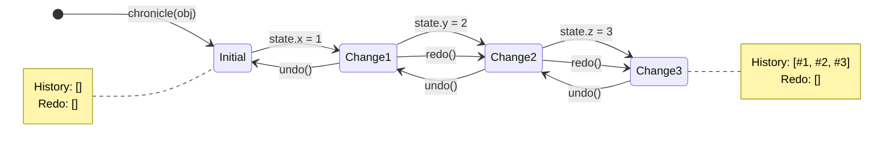
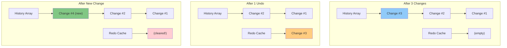

# History & Time-Travel

Explore Chronicle's powerful undo/redo system, learn how history recording works, and master time-travel debugging techniques.

## What is History?

Chronicle automatically records every change to your observable state, creating a complete audit trail. This enables:

- ⏮️ **Undo/Redo**: Travel backward and forward through state changes
- 🔍 **Debugging**: See exactly what changed, when, and why
- 📊 **Audit Trails**: Track all modifications for compliance or analysis
- 🎯 **Checkpoints**: Mark important states for later restoration

## Basic Undo/Redo

### Your First Undo

```typescript
import { chronicle } from '@arcmantle/chronicle';

const state = chronicle({ count: 0 });

state.count = 1;
state.count = 2;
state.count = 3;

console.log(state.count); // 3

chronicle.undo(state);
console.log(state.count); // 2

chronicle.undo(state);
console.log(state.count); // 1

chronicle.redo(state);
console.log(state.count); // 2
```

### Checking Undo/Redo Availability

```typescript
// Check if undo is possible
if (chronicle.canUndo(state)) {
  chronicle.undo(state);
}

// Check if redo is possible
if (chronicle.canRedo(state)) {
  chronicle.redo(state);
}

// Get counts
const history = chronicle.getHistory(state);
console.log(`Can undo ${history.past.length} operations`);
console.log(`Can redo ${history.future.length} operations`);
```

## How History Works

### Change Recording

Every property modification creates a history entry:

```typescript
const user = chronicle({
  name: 'Alice',
  email: 'alice@example.com'
});

user.name = 'Bob';
// History: [{ path: ['name'], oldValue: 'Alice', newValue: 'Bob' }]

user.email = 'bob@example.com';
// History: [
//   { path: ['name'], oldValue: 'Alice', newValue: 'Bob' },
//   { path: ['email'], oldValue: 'alice@example.com', newValue: 'bob@example.com' }
// ]
```

### History Stack Structure

Chronicle maintains two stacks:



**Stack Visualization:**



### Redo Stack Clearing

Making a new change clears the redo stack:

```typescript
state.count = 1;
state.count = 2;
state.count = 3;

chronicle.undo(state); // count = 2, can redo
chronicle.undo(state); // count = 1, can redo

state.count = 10; // New change! Redo stack cleared

chronicle.redo(state); // ❌ Nothing to redo
```

::: tip Design Decision
This behavior is standard in most undo/redo systems (like text editors) because a new change creates a different timeline.
:::

## History Groups

Group multiple changes into a single undo-able operation:

### Automatic Grouping with Batches

```typescript
const cart = chronicle({
  items: [],
  total: 0,
  tax: 0
});

// Without batching: 3 separate undo operations
cart.items.push({ id: 1, price: 10 });
cart.total = 10;
cart.tax = 1;

chronicle.undo(cart); // Only undoes tax
chronicle.undo(cart); // Only undoes total
chronicle.undo(cart); // Only undoes items

// With batching: 1 undo operation
chronicle.batch(cart, (state) => {
  state.items.push({ id: 1, price: 10 });
  state.total = 10;
  state.tax = 1;
});

chronicle.undo(cart); // Undoes all three changes!
```

### Manual Batching

```typescript
// Start a batch
chronicle.beginBatch(state);

state.user.name = 'Bob';
state.user.email = 'bob@example.com';
state.user.age = 30;

// Commit the batch
chronicle.commitBatch(state);

// One undoGroups(1) reverts all three changes
chronicle.undoGroups(state, 1);
```

## History Configuration

Customize how Chronicle records and manages history:

### Basic Configuration

```typescript
chronicle.configure(state, {
  maxHistory: 50,                    // Keep last 50 operations (default: 1000)
  mergeUngrouped: true,              // Auto-group rapid changes (default: true)
  mergeWindowMs: 100,                // Group changes within 100ms (default: 300)
  compactConsecutiveSamePath: true,  // Merge consecutive sets to same path (default: true)
  filter: (change) => {
    // Don't record temporary UI state
    return !change.path.includes('ui');
  }
});
```

### Configuration Options

```typescript
interface ChronicleOptions {
  // Maximum history entries to keep
  maxHistory?: number;                    // Default: 1000

  // Auto-merge ungrouped changes
  mergeUngrouped?: boolean;               // Default: true
  mergeWindowMs?: number;                 // Default: 300

  // Compact consecutive sets to same path in same group
  compactConsecutiveSamePath?: boolean;   // Default: true

  // Filter which changes to record
  filter?: (change: ChangeRecord) => boolean;

  // Custom clone function for snapshots
  clone?: (value: any) => any;            // Default: structuredClone

  // Custom comparison for diff
  compare?: (a: any, b: any, path: string[]) => boolean;  // true = equal

  // Filter diff paths
  diffFilter?: (path: string[]) => boolean | 'shallow';

  // Enable stable proxy identity
  cacheProxies?: boolean;                 // Default: true
}
```

### Max History Example

```typescript
chronicle.configure(state, {
  maxHistory: 10
});

// Make 15 changes
for (let i = 0; i < 15; i++) {
  state.count = i;
}

// Can only undo 10 times (oldest 5 changes discarded)
const history = chronicle.getHistory(state);
console.log(history.past.length); // 10
```

### Merge Window Example

```typescript
chronicle.configure(state, {
  mergeUngrouped: true,
  mergeWindowMs: 300
});

// Rapid changes within 300ms are merged
state.searchQuery = 'h';
state.searchQuery = 'he';
state.searchQuery = 'hel';
state.searchQuery = 'hello';

// Wait 300ms...

// All four changes merged into one undo operation!
chronicle.undo(state);
console.log(state.searchQuery); // '' (back to initial)
```

### History Filter Example

```typescript
chronicle.configure(state, {
  filter: (change) => {
    // Don't record cursor position changes
    if (change.path[0] === 'cursor') return false;

    // Don't record mouse coordinates
    if (change.path[0] === 'mouse') return false;

    // Record everything else
    return true;
  }
});

state.cursor = { x: 10, y: 20 }; // Not recorded
state.content = 'Hello';          // Recorded
```

## Inspecting History

### Get Complete History

```typescript
const history = chronicle.getHistory(state);

console.log('Past changes:', history.past);
console.log('Future changes:', history.future);
console.log('Can undo:', history.past.length > 0);
console.log('Can redo:', history.future.length > 0);
```

### History Entry Structure

```typescript
interface HistoryEntry {
  changes: ChangeRecord[];  // All changes in this entry
  groupId?: string;         // Group ID if part of batch
  timestamp: number;        // When recorded
}

interface ChangeRecord {
  path: string[];           // Property path
  oldValue: any;            // Value before change
  newValue: any;            // Value after change
  changeType: 'set' | 'delete';
  timestamp: number;
}
```

### Example: History Viewer

```typescript
function displayHistory(state: any) {
  const history = chronicle.getHistory(state);

  console.log('=== UNDO STACK ===');
  history.past.forEach((entry, index) => {
    console.log(`${index + 1}. Group ${entry.groupId || 'none'} (${entry.changes.length} changes)`);
    entry.changes.forEach(change => {
      console.log(`   ${change.path.join('.')}: ${change.oldValue} → ${change.newValue}`);
    });
  });

  console.log('\n=== REDO STACK ===');
  history.future.forEach((entry, index) => {
    console.log(`${index + 1}. Group ${entry.groupId || 'none'}`);
  });
}
```

## Advanced History Features

### Clear History

```typescript
// Clear all history (keeps current state)
chronicle.clearHistory(state);

// No more undo/redo
console.log(chronicle.canUndo(state)); // false
console.log(chronicle.canRedo(state)); // false
```

### History Markers

Mark important points in history for later reference:

```typescript
// Mark current point in history
const checkpoint = chronicle.mark(state);

// Make changes
state.content = 'Some text';
state.content = 'More text';
state.content = 'Even more text';

// Undo back to checkpoint
chronicle.undoSince(state, checkpoint);
console.log(state.content); // Back to original (before marker)
```

::: tip How It Works
`mark()` returns the current history length as a marker. `undoSince(marker)` calculates how many steps to undo and reverts to that point.
:::

## Time-Travel Debugging

### Technique 1: Step Through Changes

```typescript
const state = chronicle({
  counter: 0,
  operations: []
});

// Perform operations
function operation(name: string, value: number) {
  chronicle.batch(state, (s) => {
    s.counter += value;
    s.operations.push(name);
  });
}

operation('add-10', 10);
operation('add-5', 5);
operation('subtract-3', -3);
operation('add-7', 7);

console.log(state.counter); // 19

// Step backward through operations
while (chronicle.canUndo(state)) {
  chronicle.undo(state);
  console.log('Counter:', state.counter);
  console.log('Operations:', state.operations);
}
// Counter: 12
// Counter: 7
// Counter: 0
```

### Technique 2: Replay Changes

```typescript
// Capture history
const history = chronicle.getHistory(state);
const snapshot = chronicle.snapshot(state);

// Reset state
chronicle.clearHistory(state);
Object.assign(state, snapshot);

// Replay each change slowly
for (const entry of history.past) {
  console.log('Replaying:', entry);

  // Apply changes
  for (const change of entry.changes) {
    // ... manual replay logic
  }

  await sleep(500); // Visualize changes
}
```

### Technique 3: Diff Between States

```typescript
// Save initial state
const initial = chronicle.snapshot(state);

// Make changes
state.user.name = 'Bob';
state.user.email = 'bob@example.com';
state.settings.theme = 'dark';

// See what changed
const diff = chronicle.diff(state);
diff.forEach(change => {
  console.log(`${change.kind} at ${change.path.join('.')}`);
  console.log(`  Before: ${change.oldValue}`);
  console.log(`  After: ${change.newValue}`);
});
```

## Common Patterns

### Pattern 1: Undo/Redo UI

```typescript
function createUndoRedoUI(state: any) {
  const undoBtn = document.getElementById('undo');
  const redoBtn = document.getElementById('redo');

  function update() {
    undoBtn.disabled = !chronicle.canUndo(state);
    redoBtn.disabled = !chronicle.canRedo(state);
  }

  undoBtn.onclick = () => {
    chronicle.undo(state);
    update();
  };

  redoBtn.onclick = () => {
    chronicle.redo(state);
    update();
  };

  // Update on any change
  chronicle.onAny(state, update);

  update(); // Initial state
}
```

### Pattern 2: Keyboard Shortcuts

```typescript
document.addEventListener('keydown', (e) => {
  // Ctrl+Z or Cmd+Z: Undo
  if ((e.ctrlKey || e.metaKey) && e.key === 'z' && !e.shiftKey) {
    if (chronicle.canUndo(state)) {
      chronicle.undo(state);
      e.preventDefault();
    }
  }

  // Ctrl+Shift+Z or Cmd+Shift+Z: Redo
  if ((e.ctrlKey || e.metaKey) && e.key === 'z' && e.shiftKey) {
    if (chronicle.canRedo(state)) {
      chronicle.redo(state);
      e.preventDefault();
    }
  }
});
```

### Pattern 3: Confirmation Before Undo

```typescript
function undoWithConfirmation(state: any) {
  if (!chronicle.canUndo(state)) return;

  const history = chronicle.getHistory(state);
  const lastEntry = history.past[history.past.length - 1];

  // Show what will be undone
  const changes = lastEntry.changes
    .map(c => `${c.path.join('.')}: ${c.newValue} → ${c.oldValue}`)
    .join('\n');

  if (confirm(`Undo these changes?\n${changes}`)) {
    chronicle.undo(state);
  }
}
```

### Pattern 4: History Persistence

```typescript
// Save history to localStorage
function saveHistory(state: any) {
  const history = chronicle.getHistory(state);
  const snapshot = chronicle.snapshot(state);

  localStorage.setItem('app-state', JSON.stringify(snapshot));
  localStorage.setItem('app-history', JSON.stringify(history));
}

// Restore history from localStorage
function loadHistory(state: any) {
  const savedState = localStorage.getItem('app-state');
  const savedHistory = localStorage.getItem('app-history');

  if (savedState && savedHistory) {
    Object.assign(state, JSON.parse(savedState));
    // Note: Restoring history requires manual reconstruction
  }
}
```

## Performance Considerations

### Memory Usage

Each history entry stores change data:

```typescript
// Small changes: Low memory
state.count = 1; // ~50 bytes per entry

// Large changes: High memory
state.largeArray = new Array(10000).fill(0); // ~40KB per entry
```

**Optimization strategies:**

```typescript
// 1. Limit history size
chronicle.configure(state, {
  maxHistory: 50 // Only keep last 50 operations
});

// 2. Filter out large changes
chronicle.configure(state, {
  filter: (change) => {
    // Don't record cache updates
    return !change.path.includes('cache');
  }
});

// 3. Use merge window for rapid changes
chronicle.configure(state, {
  mergeUngrouped: true,
  mergeWindowMs: 100
});
```

### History Trimming

```typescript
// Manually trim old history
function trimHistory(state: any, keepLast: number) {
  const history = chronicle.getHistory(state);

  if (history.past.length > keepLast) {
    // Remove oldest entries
    history.past.splice(0, history.past.length - keepLast);
  }
}

// Auto-trim on every change
chronicle.onAny(state, () => {
  trimHistory(state, 100);
});
```

## Debugging Tips

### Log All History Operations

```typescript
if (process.env.NODE_ENV === 'development') {
  const originalUndo = chronicle.undo;
  const originalRedo = chronicle.redo;

  chronicle.undo = function(state: any) {
    console.log('[Chronicle] Undo');
    const result = originalUndo(state);
    console.log('[Chronicle] State:', state);
    return result;
  };

  chronicle.redo = function(state: any) {
    console.log('[Chronicle] Redo');
    const result = originalRedo(state);
    console.log('[Chronicle] State:', state);
    return result;
  };
}
```

### Visualize History Timeline

```typescript
function visualizeHistory(state: any) {
  const history = chronicle.getHistory(state);

  console.log('Timeline:');
  console.log('─'.repeat(50));

  history.past.forEach((entry, index) => {
    const changes = entry.changes.length;
    const grouped = entry.groupId ? ' (grouped)' : '';
    console.log(`${index}: [${changes} change${changes > 1 ? 's' : ''}]${grouped}`);
  });

  console.log('>>> CURRENT STATE <<<');

  history.future.forEach((entry, index) => {
    const changes = entry.changes.length;
    console.log(`${index}: [${changes} change${changes > 1 ? 's' : ''}]`);
  });
}
```

## Next Steps

Now that you understand history and time-travel, learn about optimizing operations:

- **[Batching & Transactions →](./batching)** - Group changes efficiently
- **[Snapshots & Diffs →](./snapshots)** - Compare and restore states
- **[Performance →](./performance)** - Optimize history usage
- **[API Reference →](../api/index)** - Complete API documentation

---

**Ready to batch operations?** Continue to [Batching & Transactions](./batching) to learn about grouping changes.
