# Listeners

Master the art of listening to state changes in Chronicle. Learn about the three listening modes, path selectors, and powerful options like debouncing and throttling.

## The Basics

Chronicle's listener system allows you to react to changes in your observable state. At its core, listening is simple:

```typescript
import { chronicle } from '@arcmantle/chronicle';

const state = chronicle({ count: 0 });

// Listen to changes
chronicle.listen(state, 'count', (path, newValue, oldValue, meta) => {
  console.log(`Count changed from ${oldValue} to ${newValue}`);
});

// Make a change
state.count = 1;
// Logs: "Count changed from 0 to 1"
```

## Listener Signature

All listeners receive four parameters:

```typescript
type ChangeListener = (
  path: string[],        // Path to the changed property
  newValue: any,         // New value after change
  oldValue: any,         // Value before change
  meta?: ChangeMeta      // Metadata about the change
) => void;

interface ChangeMeta {
  changeType: 'set' | 'delete';
  timestamp: number;
  groupId?: string;      // If part of a batch
}
```

### Example

```typescript
chronicle.listen(state, 'user.name', (path, newVal, oldVal, meta) => {
  console.log('Path:', path);           // ['user', 'name']
  console.log('New value:', newVal);     // 'Bob'
  console.log('Old value:', oldVal);     // 'Alice'
  console.log('Type:', meta?.changeType); // 'set'
  console.log('When:', meta?.timestamp); // 1735567890123
});

state.user.name = 'Bob';
```

## Path Selectors

Chronicle supports three ways to specify which property to listen to:

### String Paths

Use dot notation for nested properties:

```typescript
chronicle.listen(state, 'user.profile.name', listener);
chronicle.listen(state, 'items.0', listener); // Array index
chronicle.listen(state, 'settings.theme', listener);
```

### Array Paths

Use arrays for more complex paths:

```typescript
chronicle.listen(state, ['user', 'profile', 'name'], listener);
chronicle.listen(state, ['items', 0], listener);
chronicle.listen(state, ['cache', 'user:123'], listener); // Keys with special chars
```

### Function Selectors

Use a function to access the property (type-safe):

```typescript
// Using an arrow function
chronicle.listen(state, s => s.user.profile.name, listener);

// TypeScript provides full autocomplete!
chronicle.listen(state, s => s.settings.theme, listener);
```

::: tip Type Safety
Function selectors provide the best TypeScript experience with full autocomplete and type checking.
:::

## Listening Modes

Chronicle offers three listening modes that determine which changes trigger your listener:

### Mode: `'exact'` (Default)

Only fires when the **exact path** changes:

```typescript
const state = chronicle({
  user: {
    name: 'Alice',
    email: 'alice@example.com'
  }
});

chronicle.listen(state, 'user.name', listener, 'exact');

state.user.name = 'Bob';     // ✅ Fires
state.user.email = 'new@ex';  // ❌ Doesn't fire
state.user = { ... };         // ❌ Doesn't fire (parent changed)
```

**Use when:** You only care about one specific property.

### Mode: `'down'` (Descendants)

Fires when the path **or any descendant** changes:

```typescript
chronicle.listen(state, 'user', listener, 'down');

state.user.name = 'Bob';      // ✅ Fires (descendant)
state.user.email = 'new@ex';   // ✅ Fires (descendant)
state.user.profile.bio = 'Hi'; // ✅ Fires (nested descendant)
state.user = { ... };          // ✅ Fires (exact match)
```

**Use when:** You want to know about any change within an object or subtree.

### Mode: `'up'` (Ancestors)

Fires when **any ancestor** changes (rare):

```typescript
chronicle.listen(state, 'user.profile.name', listener, 'up');

state.user.profile.name = 'Bob'; // ✅ Fires (exact)
state.user.profile = { ... };     // ✅ Fires (ancestor)
state.user = { ... };             // ✅ Fires (ancestor)
state.settings = { ... };         // ❌ Doesn't fire (unrelated)
```

**Use when:** You need to know if a value or any of its parents changed (uncommon).

## Visual Comparison

```mermaid
graph TB
    Root["app (root)"]
    Root --> User["user"]
    Root --> Settings["settings"]
    User --> Name["name: 'Alice'"]
    User --> Profile["profile 🎯"]
    Profile --> Bio["bio: 'Developer'"]
    Settings --> Theme["theme: 'dark'"]

    style Profile fill:#ffd54f,stroke:#f57c00,stroke-width:3px
    style Root fill:#e8f5e9
    style User fill:#c8e6c9
    style Settings fill:#c8e6c9
    style Name fill:#a5d6a7
    style Bio fill:#81c784
    style Theme fill:#a5d6a7
```



**Listener at `'user.profile'` (marked with 🎯):**

| Mode | Fires On | Use Case |
| --- | --- | --- |
| `'exact'` | `user.profile = {...}` | Only when profile object is replaced |
| `'down'` (default) | `user.profile = {...}` or `user.profile.bio = 'Senior Dev'` | Profile or any child property changes |
| `'up'` | `user.profile = {...}` or `user = {...}` or `(root replaced)` | Profile or any ancestor changes |

```mermaid
graph LR
    A["Change at user.profile.bio"] --> B{Listener Mode}
    B -->|exact| C["❌ No fire<br/>Not exact match"]
    B -->|down| D["✅ Fires<br/>Child changed"]
    B -->|up| E["✅ Fires<br/>Descendant changed"]

    style A fill:#e3f2fd
    style B fill:#fff9c4
    style C fill:#ffcdd2
    style D fill:#c8e6c9
    style E fill:#c8e6c9
```



## Listener Options

Chronicle provides powerful options to control listener behavior:

### Once: One-Time Listeners

Auto-unsubscribe after the first invocation:

```typescript
chronicle.listen(state, 'initialized', () => {
  console.log('App initialized!');
}, { once: true });

state.initialized = true;  // Logs: "App initialized!"
state.initialized = false; // Doesn't log (already unsubscribed)
```

**Use when:** You only need to react to the first occurrence.

### Debounce: Coalesce Rapid Changes

Wait for changes to settle before firing:

```typescript
chronicle.listen(state, 'searchQuery', (path, query) => {
  performSearch(query);
}, { debounceMs: 300 });

// User types quickly:
state.searchQuery = 'h';
state.searchQuery = 'he';
state.searchQuery = 'hel';
state.searchQuery = 'hello';

// performSearch() called ONCE with 'hello' after 300ms
```

**Use when:**

- Search inputs
- Form validation
- Auto-save functionality
- Any rapid, successive changes

### Throttle: Limit Call Frequency

Ensure listener doesn't fire more than once per time window:

```typescript
chronicle.listen(state, 'mousePosition', (path, pos) => {
  updateUI(pos);
}, { throttleMs: 16 }); // ~60fps

// Mouse moves rapidly:
state.mousePosition = { x: 10, y: 20 };
state.mousePosition = { x: 11, y: 21 };
state.mousePosition = { x: 12, y: 22 };
// ... many more updates

// updateUI() called at most once every 16ms
```

**Use when:**

- Mouse/pointer tracking
- Scroll handlers
- Real-time updates
- Performance-critical handlers

### Schedule: Timing Control

Control when listeners execute:

```typescript
// Synchronous (default) - immediate execution
chronicle.listen(state, 'count', listener, { schedule: 'sync' });

// Microtask - deferred to next microtask
chronicle.listen(state, 'count', listener, { schedule: 'microtask' });

state.count = 1; // sync fires immediately, microtask fires after
```

**Use when:**

- `'sync'`: You need immediate notification (default)
- `'microtask'`: You want to batch multiple synchronous changes

## Combining Options

Options can be combined for powerful effects:

```typescript
// Debounced, one-time initialization checker
chronicle.listen(state, 'config', () => {
  console.log('Config settled!');
}, {
  debounceMs: 500,
  once: true
});

// Throttled scroll handler with microtask scheduling
chronicle.listen(state, 'scrollY', updateScrollIndicator, {
  throttleMs: 100,
  schedule: 'microtask'
});
```

## Listening to Everything: `onAny`

Listen to **all changes** on an object:

```typescript
chronicle.onAny(state, (path, newVal, oldVal, meta) => {
  console.log(`Something changed at: ${path.join('.')}`);
});

state.user.name = 'Bob';     // Logs: "Something changed at: user.name"
state.settings.theme = 'dark'; // Logs: "Something changed at: settings.theme"
state.count++;                // Logs: "Something changed at: count"
```

::: warning Performance
`onAny` fires for every single change. Use sparingly and prefer specific path listeners when possible.
:::

**Use when:**

- Debugging state changes
- Implementing global change logging
- Syncing state to external storage
- Development tools

## Unsubscribing

All listener methods return an unsubscribe function:

```typescript
// Save the unsubscribe function
const unlisten = chronicle.listen(state, 'count', listener);

// Later: stop listening
unlisten();

// Changes no longer trigger listener
state.count = 100; // Listener doesn't fire
```

### Automatic Cleanup

```typescript
function setupComponent() {
  const state = chronicle({ active: false });

  const unlisten = chronicle.listen(state, 'active', handleActiveChange);

  // Return cleanup function
  return () => {
    unlisten();
  };
}

// Later
const cleanup = setupComponent();
cleanup(); // Removes listener
```

## Working with Arrays

Listening to array changes has special considerations:

### Listening to Entire Array

```typescript
const state = chronicle({ items: [1, 2, 3] });

// Listen to array itself (replacements)
chronicle.listen(state, 'items', (path, newVal, oldVal) => {
  console.log('Array replaced');
}, 'exact');

state.items = [4, 5, 6]; // Fires
state.items.push(7);      // Doesn't fire (items not replaced)
```

### Listening to Array Mutations

```typescript
// Listen to array AND all elements
chronicle.listen(state, 'items', (path) => {
  console.log(`Changed at: ${path.join('.')}`);
}, 'down');

state.items.push(4);      // Fires: "Changed at: items.3"
state.items[0] = 10;      // Fires: "Changed at: items.0"
state.items.splice(1, 1); // Fires: "Changed at: items"
```

### Listening to Specific Index

```typescript
// Listen to first item only
chronicle.listen(state, 'items.0', (path, newVal, oldVal) => {
  console.log(`First item: ${oldVal} → ${newVal}`);
});

state.items[0] = 100; // Fires
state.items[1] = 200; // Doesn't fire
```

## Working with Maps and Sets

### Map Listeners

```typescript
const state = chronicle({
  cache: new Map()
});

chronicle.listen(state, 'cache', (path, newVal, oldVal, meta) => {
  const key = path[path.length - 1];
  console.log(`Map ${meta?.changeType}: ${key}`);
}, 'down');

state.cache.set('user:1', { name: 'Alice' });
// Logs: "Map set: user:1"

state.cache.delete('user:1');
// Logs: "Map delete: user:1"
```

### Set Listeners

```typescript
const state = chronicle({
  tags: new Set()
});

chronicle.listen(state, 'tags', (path, newVal, oldVal, meta) => {
  console.log(`Set ${meta?.changeType}:`, newVal);
}, 'down');

state.tags.add('typescript');
// Logs: "Set set: typescript"

state.tags.delete('typescript');
// Logs: "Set delete: typescript"
```

## Common Patterns

### Computed Values

Derive values from multiple sources:

```typescript
const cart = chronicle({
  items: [] as Array<{ price: number; qty: number }>,
  discount: 0,
  tax: 0.1
});

// Recompute total when anything changes
chronicle.onAny(cart, () => {
  const subtotal = cart.items.reduce((sum, item) =>
    sum + item.price * item.qty, 0
  );
  const afterDiscount = subtotal - cart.discount;
  const total = afterDiscount * (1 + cart.tax);

  updateUI({ total });
});
```

### Validation

Validate data on change:

```typescript
const form = chronicle({
  email: '',
  password: ''
});

chronicle.listen(form, 'email', (path, email) => {
  if (!email.includes('@')) {
    showError('Invalid email');
  } else {
    clearError();
  }
});

chronicle.listen(form, 'password', (path, password) => {
  if (password.length < 8) {
    showError('Password too short');
  } else {
    clearError();
  }
});
```

### Cross-Field Dependencies

React when related fields change:

```typescript
const order = chronicle({
  quantity: 1,
  unitPrice: 10,
  total: 10
});

// Update total when quantity or price changes
chronicle.listen(order, ['quantity', 'unitPrice'], () => {
  order.total = order.quantity * order.unitPrice;
});
```

::: tip Multiple Paths
To listen to multiple paths, create separate listeners or use `onAny` with a filter.
:::

### Sync to LocalStorage

Persist state automatically:

```typescript
const settings = chronicle({
  theme: 'dark',
  fontSize: 14,
  autoSave: true
});

// Save to localStorage on any change
chronicle.onAny(settings, () => {
  localStorage.setItem('settings', JSON.stringify(
    chronicle.snapshot(settings)
  ));
}, { debounceMs: 1000 }); // Debounce to reduce writes
```

### React Integration

Trigger React re-renders:

```typescript
import { useState, useEffect } from 'react';

function useChronicle<T extends object>(state: T, path?: string) {
  const [, forceUpdate] = useState({});

  useEffect(() => {
    const unlisten = path
      ? chronicle.listen(state, path, () => forceUpdate({}), 'down')
      : chronicle.onAny(state, () => forceUpdate({}));

    return unlisten;
  }, [state, path]);

  return state;
}

// Usage
function TodoList({ state }) {
  useChronicle(state, 'todos'); // Re-render when todos change

  return (
    <ul>
      {state.todos.map(todo => (
        <li key={todo.id}>{todo.text}</li>
      ))}
    </ul>
  );
}
```

## Pause and Resume

Temporarily disable all listeners:

```typescript
const state = chronicle({ count: 0 });

chronicle.listen(state, 'count', () => {
  console.log('Count changed!');
});

// Pause notifications
chronicle.pause(state);

state.count = 1; // No log
state.count = 2; // No log

// Resume notifications
chronicle.resume(state);

state.count = 3; // Logs: "Count changed!"
```

**Use when:**

- Bulk updates without triggering listeners
- Temporarily disabling reactivity
- Performance optimization during initialization

::: tip Batching Alternative
Consider using `chronicle.batch()` instead, which groups changes into one undo-able operation AND defers notifications until the batch completes.
:::

## Performance Tips

### Be Specific

```typescript
// ❌ Less efficient: Listens to everything
chronicle.onAny(state, () => {
  if (path[0] === 'user' && path[1] === 'name') {
    // ...
  }
});

// ✅ More efficient: Listens to specific path
chronicle.listen(state, 'user.name', () => {
  // ...
});
```

### Use Debounce for Rapid Changes

```typescript
// ❌ Fires on every keystroke
chronicle.listen(state, 'searchQuery', performExpensiveSearch);

// ✅ Waits for user to stop typing
chronicle.listen(state, 'searchQuery', performExpensiveSearch, {
  debounceMs: 300
});
```

### Unsubscribe When Done

```typescript
// ❌ Memory leak: Listener never removed
function setupWatcher() {
  chronicle.listen(state, 'data', processData);
}

// ✅ Proper cleanup
function setupWatcher() {
  const unlisten = chronicle.listen(state, 'data', processData);
  return unlisten; // Caller can clean up
}
```

### Avoid Heavy Computation in Listeners

```typescript
// ❌ Heavy work on every change
chronicle.listen(state, 'data', (path, data) => {
  const result = expensiveComputation(data); // Blocks thread
  updateUI(result);
});

// ✅ Defer heavy work
chronicle.listen(state, 'data', (path, data) => {
  queueMicrotask(() => {
    const result = expensiveComputation(data);
    updateUI(result);
  });
}, { schedule: 'microtask' });
```

## Debugging Listeners

### Log All Changes

```typescript
if (process.env.NODE_ENV === 'development') {
  chronicle.onAny(state, (path, newVal, oldVal) => {
    console.log(`[Chronicle] ${path.join('.')}: ${oldVal} → ${newVal}`);
  });
}
```

### Count Listener Calls

```typescript
let callCount = 0;

chronicle.listen(state, 'expensive', () => {
  callCount++;
  console.log(`Called ${callCount} times`);
});
```

### Check for Memory Leaks

```typescript
const listeners = new Set();

function trackListener(unlisten) {
  listeners.add(unlisten);
  return () => {
    unlisten();
    listeners.delete(unlisten);
  };
}

// Usage
const unlisten = trackListener(
  chronicle.listen(state, 'data', handler)
);

// Check active listeners
console.log(`Active listeners: ${listeners.size}`);
```

## Next Steps

Now that you've mastered listeners, explore other Chronicle features:

- **[History & Time-Travel →](./history)** - Undo, redo, and debugging with history
- **[Batching & Transactions →](./batching)** - Group changes efficiently
- **[Performance →](./performance)** - Optimize listener performance
- **[API Reference →](../api/index)** - Complete API documentation

---

**Ready for time-travel?** Continue to [History & Time-Travel](./history) to master undo/redo.
