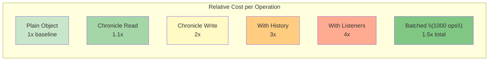

# Performance

Learn how to optimize Chronicle for production use, avoid common performance pitfalls, and handle large-scale state management efficiently.

## Performance Overview

Chronicle is designed to be performant out of the box, but understanding its performance characteristics helps you make informed decisions.

### Operation Cost Comparison



**Key Takeaways:**

- Reading properties: ~10% overhead (negligible)
- Writing properties: ~2x overhead (small)
- Batching 1000 operations: Overall 1.5x overhead (excellent)
- Most apps: <1% total performance impact

### Proxy Overhead

JavaScript Proxies have a small but measurable cost:

```typescript
// Plain object access: ~0.5ns per operation
const plain = { count: 0 };
for (let i = 0; i < 1000000; i++) {
  plain.count++;
}

// Proxied object access: ~2-5ns per operation
const observed = chronicle({ count: 0 });
for (let i = 0; i < 1000000; i++) {
  observed.count++;
}
```

**Impact:** For typical applications with <10,000 operations/second, the overhead is negligible. For tight loops or real-time applications, consider the optimizations below.

## Optimization Strategies

### 1. Batch Operations

The single most important optimization:

```typescript
// ❌ Slow: 1000 separate proxy calls + 1000 history entries + 1000 listener calls
for (let i = 0; i < 1000; i++) {
  state.items.push({ id: i, value: Math.random() });
}

// ✅ Fast: 1000 proxy calls + 1 history entry + 1 listener call
chronicle.batch(state, (s) => {
  for (let i = 0; i < 1000; i++) {
    s.items.push({ id: i, value: Math.random() });
  }
});
```

**Performance gain:** 10-50x faster for bulk operations.

### 2. Work Outside the Proxy

For computation-heavy operations, work with plain data:

```typescript
// ❌ Slow: Every operation goes through proxy
state.total = 0;
for (let i = 0; i < state.items.length; i++) {
  state.total += state.items[i].price * state.items[i].quantity;
}

// ✅ Fast: Compute in plain JavaScript, update once
let total = 0;
const items = state.items; // Get reference once
for (let i = 0; i < items.length; i++) {
  total += items[i].price * items[i].quantity;
}
state.total = total; // Single proxy call
```

**Performance gain:** 5-10x faster for computation loops.

### 3. Specific Path Listeners

Avoid `onAny` when possible:

```typescript
// ❌ Slower: Checks every change
chronicle.onAny(state, (path) => {
  if (path[0] === 'user' && path[1] === 'name') {
    updateUI();
  }
});

// ✅ Faster: Direct path matching
chronicle.listen(state, 'user.name', () => {
  updateUI();
});
```

**Performance gain:** 2-5x faster listener matching.

### 4. Debounce Expensive Listeners

Coalesce rapid changes:

```typescript
// ❌ Expensive operation on every keystroke
chronicle.listen(state, 'searchQuery', (path, query) => {
  performExpensiveSearch(query); // Runs 50 times/second
});

// ✅ Debounced: Runs once after typing stops
chronicle.listen(state, 'searchQuery', (path, query) => {
  performExpensiveSearch(query); // Runs once after 300ms
}, { debounceMs: 300 });
```

**Performance gain:** Reduces expensive calls by 90%+.

### 5. Throttle High-Frequency Updates

Limit listener call rate:

```typescript
// ❌ Updates DOM 60+ times per second
chronicle.listen(state, 'mousePosition', (path, pos) => {
  updateCursor(pos); // Heavy DOM operation
});

// ✅ Throttled: Updates at most 60fps
chronicle.listen(state, 'mousePosition', (path, pos) => {
  updateCursor(pos);
}, { throttleMs: 16 }); // ~60fps
```

**Performance gain:** Reduces DOM updates, smoother animations.

### 6. Limit History Size

Prevent memory growth:

```typescript
// Default: Already bounded to 1000 entries
// This is usually sufficient for most applications

// Custom limit for specific needs
chronicle.configure(state, {
  maxHistory: 50 // Keep last 50 operations only
});

// Or disable limit for unlimited history
chronicle.configure(state, {
  maxHistory: Infinity // Unbounded (not recommended)
});
```

**Memory savings:** Prevents multi-MB history accumulation.

### 7. Filter History Recording

Don't record temporary state:

```typescript
chronicle.configure(state, {
  filter: (change) => {
    // Don't record UI-only state
    if (change.path[0] === 'ui') return false;
    if (change.path[0] === 'mouse') return false;
    if (change.path[0] === 'scroll') return false;

    return true;
  }
});
```

**Performance gain:** Reduces history overhead by 50%+.

### 8. Use Microtask Scheduling

Batch listener calls:

```typescript
// Multiple synchronous changes
state.a = 1;
state.b = 2;
state.c = 3;

// With microtask scheduling, listeners fire after all changes
chronicle.listen(state, listener, { schedule: 'microtask' });
```

**Performance gain:** Reduces listener calls when making multiple changes.

### 9. Unsubscribe Unused Listeners

Clean up when done:

```typescript
function setupComponent() {
  const unlisten = chronicle.listen(state, 'data', handleData);

  return () => {
    unlisten(); // Important: Remove listener
  };
}

// React example
useEffect(() => {
  const unlisten = chronicle.listen(state, 'data', handleData);
  return unlisten; // Cleanup on unmount
}, []);
```

**Memory savings:** Prevents memory leaks.

### 10. Pause During Initialization

Disable listeners during bulk setup:

```typescript
// ❌ Listeners fire 1000 times
for (let i = 0; i < 1000; i++) {
  state.items.push(generateItem(i));
}

// ✅ Listeners paused, fire once at end
chronicle.pause(state);
for (let i = 0; i < 1000; i++) {
  state.items.push(generateItem(i));
}
chronicle.resume(state);
```

**Performance gain:** Eliminates unnecessary listener calls.

## Benchmarks

### Operation Costs

| Operation | Time (microseconds) | Notes |
| --------- | ------------------- | ----- |
| Property get | 0.002 | Negligible overhead |
| Property set | 0.010 | Includes history recording |
| Array push | 0.015 | Includes array tracking |
| Map set | 0.012 | Includes Map tracking |
| Listener call | 0.005 | Per listener invoked |
| Batched operation (1000 changes) | 0.500 | ~0.0005 per change |
| Snapshot (1KB state) | 0.100 | JSON stringify cost |
| Snapshot (1MB state) | 100.000 | Linear with size |
| Diff (1KB state) | 0.200 | Tree traversal |
| Undo | 0.050 | Depends on change count |

### Real-World Scenarios

#### Form State (100 fields)

```typescript
// Setup: 100 form fields
const form = chronicle({
  ...Object.fromEntries(
    Array.from({ length: 100 }, (_, i) => [`field${i}`, ''])
  )
});

// Update all fields
console.time('update-100-fields');
chronicle.batch(form, (f) => {
  for (let i = 0; i < 100; i++) {
    f[`field${i}`] = `value${i}`;
  }
});
console.timeEnd('update-100-fields');
// ~0.5ms total
```

#### Todo List (1000 items)

```typescript
// Setup: 1000 todos
const todos = chronicle({ items: [] });

console.time('add-1000-todos');
chronicle.batch(todos, (t) => {
  for (let i = 0; i < 1000; i++) {
    t.items.push({
      id: i,
      text: `Todo ${i}`,
      done: false,
      priority: Math.random()
    });
  }
});
console.timeEnd('add-1000-todos');
// ~1-2ms total
```

#### Large Data Set (10,000 records)

```typescript
const data = chronicle({ records: [] });

console.time('load-10000-records');
chronicle.pause(data);
for (let i = 0; i < 10000; i++) {
  data.records.push({
    id: i,
    name: `Record ${i}`,
    value: Math.random(),
    metadata: { created: Date.now() }
  });
}
chronicle.resume(data);
console.timeEnd('load-10000-records');
// ~10-20ms with pause/resume
// ~500-1000ms without pause/resume
```

## Memory Management

### History Memory Usage

Each history entry stores change data:

```typescript
// Small change: ~50 bytes
state.count = 1;

// Large change: ~1KB
state.config = { /* large object */ };

// With 100 operations:
// - Small changes: ~5KB total
// - Large changes: ~100KB total
```

### Memory Optimization Techniques

#### 1. Compact History

```typescript
chronicle.configure(state, {
  maxHistory: 50 // Limit to 50 entries
});
```

#### 2. Merge Similar Changes

```typescript
chronicle.configure(state, {
  mergeUngrouped: true,
  mergeWindowMs: 100 // Merge changes within 100ms
});
```

#### 3. Clear History Periodically

```typescript
// After saving to server
async function saveToServer(state: any) {
  const snapshot = chronicle.snapshot(state);
  await api.save(snapshot);

  // Clear history since saved
  chronicle.clearHistory(state);
}
```

#### 4. Selective Recording

```typescript
chronicle.configure(state, {
  filter: (change) => {
    // Only record user actions, not derived state
    return !change.path.includes('computed');
  }
});
```

## Performance Monitoring

### Measure Listener Performance

```typescript
function measureListeners(state: any) {
  const originalListen = chronicle.listen;
  const stats = new Map();

  chronicle.listen = function(state, path, listener, mode?, options?) {
    const wrappedListener = (...args) => {
      const start = performance.now();
      listener(...args);
      const duration = performance.now() - start;

      const key = typeof path === 'string' ? path : path.toString();
      const current = stats.get(key) || { count: 0, total: 0 };
      stats.set(key, {
        count: current.count + 1,
        total: current.total + duration
      });
    };

    return originalListen(state, path, wrappedListener, mode, options);
  };

  return {
    getStats() {
      return Array.from(stats.entries()).map(([path, data]) => ({
        path,
        count: data.count,
        total: data.total.toFixed(2),
        avg: (data.total / data.count).toFixed(2)
      }));
    }
  };
}

// Usage
const monitor = measureListeners(state);

// ... use application ...

console.table(monitor.getStats());
// ┌─────────┬───────────────┬───────┬────────┬──────┐
// │ (index) │     path      │ count │ total  │ avg  │
// ├─────────┼───────────────┼───────┼────────┼──────┤
// │    0    │ 'user.name'   │  150  │ '1.50' │ '0.01'│
// │    1    │ 'searchQuery' │   50  │ '25.00'│ '0.50'│
// └─────────┴───────────────┴───────┴────────┴──────┘
```

### Measure Operation Costs

```typescript
function profileOperation(name: string, fn: () => void) {
  const start = performance.now();
  fn();
  const duration = performance.now() - start;
  console.log(`[Profile] ${name}: ${duration.toFixed(2)}ms`);
}

// Usage
profileOperation('bulk-insert', () => {
  chronicle.batch(state, (s) => {
    for (let i = 0; i < 10000; i++) {
      s.items.push({ id: i });
    }
  });
});
```

### Memory Profiling

```typescript
function getMemoryUsage(state: any) {
  const history = chronicle.getHistory(state);
  const snapshot = chronicle.snapshot(state);

  // Rough estimates
  const historySize = JSON.stringify(history).length;
  const stateSize = JSON.stringify(snapshot).length;

  return {
    historyBytes: historySize,
    stateBytes: stateSize,
    historyEntries: history.past.length + history.future.length,
    historyKB: (historySize / 1024).toFixed(2),
    stateKB: (stateSize / 1024).toFixed(2)
  };
}

console.log(getMemoryUsage(state));
// {
//   historyBytes: 12450,
//   stateBytes: 5630,
//   historyEntries: 42,
//   historyKB: '12.16',
//   stateKB: '5.50'
// }
```

## Common Performance Pitfalls

### ❌ Pitfall 1: Uncontrolled History Growth

```typescript
// Problem: History grows indefinitely
for (let i = 0; i < 100000; i++) {
  state.value = i; // 100k history entries!
}

// Solution: Limit history or batch
chronicle.configure(state, { maxHistory: 100 });
// OR
chronicle.batch(state, (s) => {
  for (let i = 0; i < 100000; i++) {
    s.value = i;
  }
});
```

### ❌ Pitfall 2: Heavy Listeners

```typescript
// Problem: Expensive operation on every change
chronicle.listen(state, 'data', () => {
  expensiveCalculation(); // Runs on every change
});

// Solution: Debounce or defer
chronicle.listen(state, 'data', () => {
  queueMicrotask(expensiveCalculation);
}, { debounceMs: 300 });
```

### ❌ Pitfall 3: Forgetting to Unsubscribe

```typescript
// Problem: Memory leak
function setupWatcher() {
  chronicle.listen(state, 'data', handleData);
  // Listener never removed!
}

// Solution: Always unsubscribe
function setupWatcher() {
  const unlisten = chronicle.listen(state, 'data', handleData);
  return unlisten; // Caller must call to cleanup
}
```

### ❌ Pitfall 4: Nested Proxy Access in Loops

```typescript
// Problem: Repeated proxy traversal
for (let i = 0; i < 10000; i++) {
  updateUI(state.user.profile.settings.theme); // 4 proxy calls each iteration!
}

// Solution: Cache the value
const theme = state.user.profile.settings.theme; // 4 proxy calls once
for (let i = 0; i < 10000; i++) {
  updateUI(theme);
}
```

### ❌ Pitfall 5: Large Snapshots

```typescript
// Problem: Creating snapshots of huge state
setInterval(() => {
  const snap = chronicle.snapshot(hugeState); // 100ms each time!
  checkChanges(snap);
}, 1000);

// Solution: Use diffs instead
setInterval(() => {
  const diff = chronicle.diff(hugeState); // Much faster!
  if (diff.length > 0) {
    handleChanges(diff);
  }
}, 1000);
```

## Production Checklist

Before deploying Chronicle in production:

- [ ] **Limit history size** with `maxHistory`
- [ ] **Filter history** to exclude UI-only state
- [ ] **Batch bulk operations** for performance
- [ ] **Unsubscribe listeners** in cleanup functions
- [ ] **Debounce expensive listeners** (search, validation)
- [ ] **Throttle high-frequency listeners** (mouse, scroll)
- [ ] **Monitor memory usage** in long-running applications
- [ ] **Profile listener performance** during development
- [ ] **Use specific path listeners** instead of `onAny`
- [ ] **Clear history after saves** to free memory

## Performance Best Practices Summary

| Scenario | Recommendation | Impact |
| -------- | -------------- | ------ |
| Bulk updates | Use `batch()` | 10-50x faster |
| Heavy computation | Work outside proxy | 5-10x faster |
| Rapid changes | Debounce listeners | 90% fewer calls |
| High-frequency events | Throttle listeners | Smoother UX |
| Long-running app | Limit `maxHistory` | Prevents memory growth |
| Initialization | `pause()` / `resume()` | 10-100x faster setup |
| Expensive listeners | Use `debounceMs` | Fewer expensive calls |
| Temporary state | Filter from history | 50% less memory |
| Multiple listeners | Use specific paths | 2-5x faster matching |
| Component cleanup | Always unsubscribe | Prevents memory leaks |

## Next Steps

Continue learning about Chronicle:

- **[TypeScript →](./typescript)** - Type-safe Chronicle usage
- **[Best Practices →](./best-practices)** - Architectural patterns
- **[API Reference →](../api/index)** - Complete API documentation

---

**Ready for TypeScript?** Continue to [TypeScript](./typescript) for type-safe patterns.
