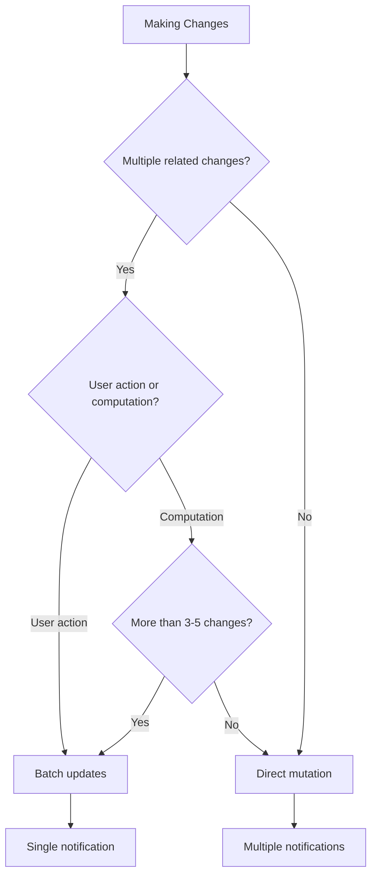
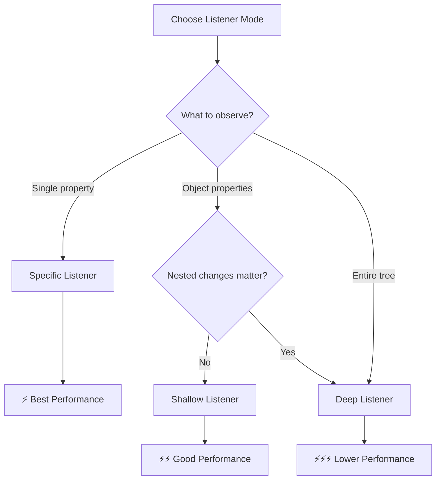
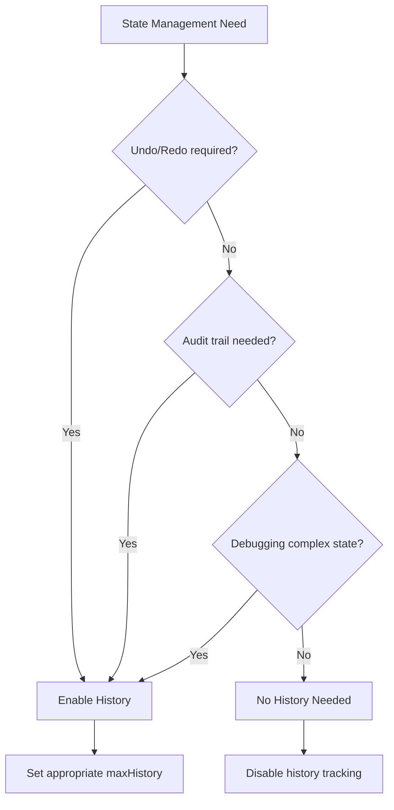

# Quick Reference

A comprehensive cheat sheet for Chronicle's API and common patterns.

## Core API

### chronicle()

Create an observable object or array.

```typescript
// Basic usage
const state = chronicle({ count: 0 });

// Arrays
const list = chronicle([1, 2, 3]);

// Configure options after creation
chronicle.configure(state, {
  maxHistory: 100,
  mergeUngrouped: true,
  mergeWindowMs: 100
});
```

**Note:** Chronicle does not accept options in the constructor. Use `chronicle.configure()` to set options after creation. See [Configuration](#chronicleconfigure) below.

### chronicle.listen()

Listen to changes on an observable object.

```typescript
// Listen to specific property (string selector)
chronicle.listen(state, 'count', (path, newVal, oldVal) => {
  console.log(`${path[0]} changed: ${oldVal} → ${newVal}`);
});

// Listen to specific property (function selector - type-safe)
chronicle.listen(state, s => s.count, (path, newVal, oldVal) => {
  console.log(`${path[0]} changed: ${oldVal} → ${newVal}`);
});

// Listen to nested property (string)
chronicle.listen(state, 'user.name', callback);

// Listen to nested property (function - recommended for type safety)
chronicle.listen(state, s => s.user.name, callback);

// Listen to entire object (shallow)
chronicle.listen(state, null, callback, 'shallow');

// Listen to entire object (deep)
chronicle.listen(state, null, callback, 'deep');

// Returns unsubscribe function
const unlisten = chronicle.listen(state, 'count', callback);
unlisten(); // Stop listening
```

**Listener Modes:**

| Mode          | Scope            | Performance    | Use Case                   |
| ------------- | ---------------- | -------------- | -------------------------- |
| `'specific'`  | Single property  | ⚡ Fastest     | Targeted updates           |
| `'shallow'`   | Direct children  | ⚡⚡ Fast      | Object-level changes       |
| `'deep'`      | All descendants  | ⚡⚡⚡ Slower  | Form state, complex objects|

### chronicle.unlisten()

Remove a listener.

```typescript
// With string selector
chronicle.unlisten(state, 'count', callback);

// With function selector
chronicle.unlisten(state, s => s.count, callback);
```

### chronicle.batch()

Group multiple changes into a single notification.

```typescript
chronicle.batch(state, () => {
  state.count++;
  state.name = 'Bob';
  state.items.push(4);
  // Single notification fired after batch completes
});
```

### chronicle.undo() / chronicle.redo()

Navigate change history.

```typescript
chronicle.undo(state);  // Revert last change
chronicle.redo(state);  // Reapply undone change

// Check if available
chronicle.canUndo(state); // boolean
chronicle.canRedo(state); // boolean
```

### chronicle.getHistory()

Access change history.

```typescript
const history = chronicle.getHistory(state);
// Returns: Array of { path, newValue, oldValue, timestamp }
```

### chronicle.clearHistory()

Clear change history.

```typescript
chronicle.clearHistory(state);
```

### chronicle.snapshot()

Create immutable snapshot.

```typescript
const snapshot = chronicle.snapshot(state);
// Returns: Plain object (not observable)
```

### chronicle.reset()

Reset to original pristine state.

```typescript
chronicle.reset(state);
// Reverts to state when chronicle() was first called
// Clears history and redo stack
```

### chronicle.markPristine()

Mark current state as the new pristine baseline.

```typescript
chronicle.markPristine(state);
// Current state becomes new "original"
// Clears history and redo stack
```

### chronicle.diff()

Compare current state with original.

```typescript
const changes = chronicle.diff(state);
// Returns: Array of changes since pristine state
```

### chronicle.isPristine()

Check if state is unchanged from pristine.

```typescript
const pristine = chronicle.isPristine(state); // boolean
```

## Common Patterns

### Form State Management

```typescript
const form = chronicle({
  name: '',
  email: '',
  isDirty: false
});

// Track dirty state
chronicle.listen(form, null, () => {
  form.isDirty = chronicle.diff(form).length > 0;
}, 'shallow');

// Reset form
const initialSnapshot = chronicle.snapshot(form);
function reset() {
  Object.assign(form, initialSnapshot);
  // Or use chronicle.reset(form) to revert to original pristine state
}
```

### Undo/Redo with UI State

```typescript
const state = chronicle({ count: 0 });
chronicle.configure(state, { maxHistory: 50 });

// UI bindings
const undoButton = document.querySelector('#undo');
const redoButton = document.querySelector('#redo');

function updateButtons() {
  undoButton.disabled = !chronicle.canUndo(state);
  redoButton.disabled = !chronicle.canRedo(state);
}

chronicle.listen(state, null, updateButtons);
updateButtons();
```

### Batch Updates for Performance

```typescript
// Batch multiple array operations
chronicle.batch(list, () => {
  list.push(1);
  list.push(2);
  list.push(3);
  list.sort();
}); // Single notification

// Batch complex state updates
chronicle.batch(state, () => {
  state.user.name = 'Alice';
  state.user.email = 'alice@example.com';
  state.user.role = 'admin';
}); // Single notification
```

### Selective Listening

```typescript
// Listen only to count changes
chronicle.listen(state, 'count', (path, newVal) => {
  updateUI(newVal);
});

// Listen to any user property change
chronicle.listen(state, 'user', (path, newVal) => {
  console.log(`User changed: ${path.join('.')}`);
}, 'shallow');
```

### Snapshot & Restore

```typescript
// Save state
const saveGame = () => {
  const snapshot = chronicle.snapshot(gameState);
  localStorage.setItem('save', JSON.stringify(snapshot));
};

// Load state
const loadGame = () => {
  const snapshot = JSON.parse(localStorage.getItem('save'));
  Object.assign(gameState, snapshot);
};
```

### Working with Arrays

```typescript
const todos = chronicle([]);

// Listen to array changes
chronicle.listen(todos, null, (path, newVal, oldVal) => {
  console.log(`Todos changed: ${todos.length} items`);
});

// Batch array operations
chronicle.batch(todos, () => {
  todos.push({ id: 1, text: 'Task 1', done: false });
  todos.push({ id: 2, text: 'Task 2', done: false });
  todos.push({ id: 3, text: 'Task 3', done: false });
});
```

### Deep Observation

```typescript
const appState = chronicle({
  users: [],
  settings: {
    theme: 'light',
    notifications: {
      email: true,
      push: false
    }
  }
});

// Deep listen to all changes
chronicle.listen(appState, null, (path, newVal, oldVal) => {
  console.log(`Changed: ${path.join('.')}`);
  console.log(`Old: ${oldVal}, New: ${newVal}`);
}, 'deep');

// Nested changes are detected
appState.settings.notifications.push = true; // Triggers listener
appState.users.push({ name: 'Bob' }); // Triggers listener
```

## Decision Trees

### When to Use Batching?



### Which Listener Mode?



### Do I Need History?



## TypeScript Types

```typescript
import type {
  ChronicleOptions,
  HistoryEntry,
  ListenerMode,
  UnlistenFn,
  ChronicleState
} from '@arcmantle/chronicle';

// Typed state
interface AppState {
  count: number;
  user: {
    name: string;
    email: string;
  };
}

const state = chronicle<AppState>({
  count: 0,
  user: { name: '', email: '' }
});

// Typed listener
const unlisten: UnlistenFn = chronicle.listen(
  state,
  'count',
  (path: string[], newVal: number, oldVal: number) => {
    console.log(`Count: ${oldVal} → ${newVal}`);
  }
);
```

## Performance Tips

### ✅ Do

- Use specific listeners when possible
- Batch related updates together
- Set appropriate `maxHistory` limits
- Use shallow listeners for object-level changes
- Clean up listeners when components unmount

### ❌ Don't

- Use deep listeners on large objects unnecessarily
- Create listeners inside loops
- Forget to unlisten when done
- Keep unlimited history for production apps
- Make synchronous changes inside listeners (can cause loops)

## Browser Support

| Browser | Minimum Version | Proxy Support |
| ------- | --------------- | ------------- |
| Chrome  | 49+             | ✅            |
| Firefox | 18+             | ✅            |
| Safari  | 10+             | ✅            |
| Edge    | 12+             | ✅            |
| IE      | Not supported   | ❌            |

## Next Steps

- [Getting Started Guide](./getting-started.md) - Learn the basics
- [Deep Observation](./deep-observation.md) - Master nested object tracking
- [Performance Guide](./performance.md) - Optimize your state management
- [Examples](./examples/todo-list.md) - See Chronicle in real applications
